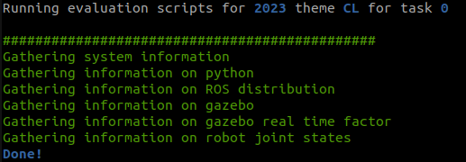

<!-- <center></center> -->

<style>
.back{
	position: fixed;
	width: 250px;
	height: 250px;
	top: 50%;
	left: 50%;
    margin-top: auto; 
    margin-left: auto; 
	opacity: 0.15;
    z-index: -1;
	}
</style>
<!--  -->

<center>
    <h1>Task 0 - Submission</h1>
</center>

---

### Submission instructions for task 0:

> * To evaluate your task 0 performed on your system, we will be requiring a *JSON file* that will be generated when you execute our auto evaluation script in parallel to your task running. Follow the instructions to submit this file and get evaluated for your task 0.
>
> * ***NOTE: All your tasks will be checked using a plagiarism software. If any submitted file is found to be plagiarised, e-Yantra reserves the right to disqualify the team.***

* Install `eyantra-autoeval` by running the command given below

    ```sh
    pip3 install -U eyantra-autoeval
    ```

* Execute auto evaluation script

    After successful installation of `eyantra-autoeval` package, execute the following command which will generate a `.json` extention file which we will be requiring for evaluating your task 0.

    ```sh
    eyantra-autoeval evaluate --year 2023 --theme CL --task 0
    ```

* If you face an error saying `eyantra-autoeval` not found, then you need to add the following line to your `~/.bashrc` file and then source it:

    ```sh
    export PATH=$PATH:~/.local/bin      # exporting system path to environment
    source ~/.bashrc                    # sourcing bashrc file
    ```


#### *IMPORTANT NOTE:*

* First launch the robot in gazebo as instructed before `ros2 launch ebot_description ebot_gazebo_launch.py` and keep it running

* Then open a new terminal and execute the auto eval script `eyantra-autoeval evaluate --year 2023 --theme CL --task 0` which will take few seconds to record your data and generate a *JSON file (Ex: result-2023-CL-0-20230904.json)* in the same directory where you launched this command.

* Sample output is shown in the terminal when you run the evaluation script and is succeeded.

    

* Once the file is generated, rename it as `<CL#team_id>` *(For example, if your team id is 1679, rename file as `CL#1679.json`)* and submit on [eYRC Portal - Task 0](https://portal.e-yantra.org/task_task0).


> **This task will be graded in a binary format**
>
>   `SUCCESS` - `Marks: 1.00` <br>
>   `FAILED`  - `Marks: 0.00`


---