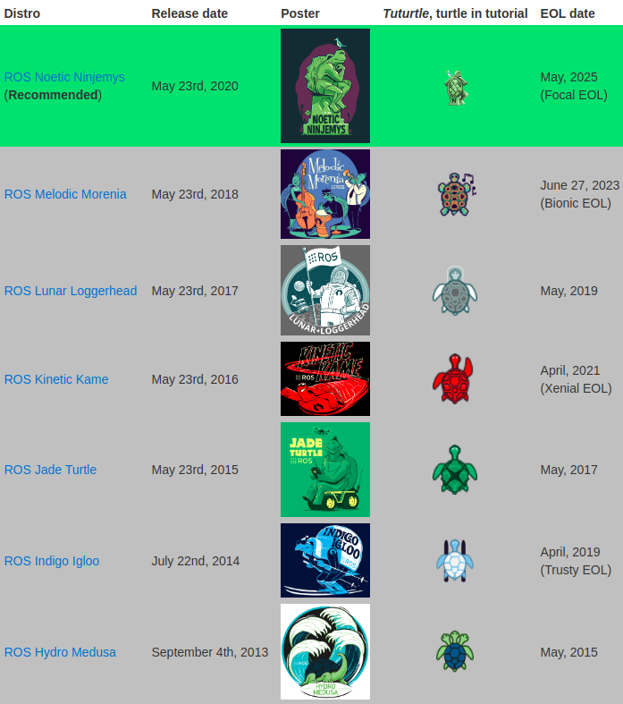

<!-- 

 -->

<!--  -->

    <h1>History of ROS</h1>

---

### The Evolution of Robotics: From ROS to ROS2

> The world of robotics has witnessed tremendous advancements over the years, largely thanks to the development and evolution of the Robot Operating System (ROS). This blog delves into the fascinating history of ROS, its early beginnings, key milestones, and the evolution to ROS2, highlighting the limitations of ROS1 and the community-driven development of ROS2.

### Early Beginnings

> The journey of ROS began with a vision to create a flexible framework for writing robot software. The inception of ROS (Robot Operating System) was driven by the need to provide a standardized platform that could support a wide variety of robotic applications.

### Origin of ROS

> ROS originated at the Stanford Artificial Intelligence Laboratory in 2007, spearheaded by researchers who recognized the need for a robust and flexible software platform for robotics. It was officially launched by Willow Garage, a robotics research lab, in 2009. The primary aim was to create a collaborative environment where researchers and developers could share code and build upon each other's work.

### The Initial Purpose and Goals of ROS

> The initial goals of ROS were straightforward yet ambitious:
> - To provide a standard for robotic software development.
> - To foster code reuse and collaboration among researchers and developers.
> - To offer a modular and scalable architecture that could support diverse robotic systems.
>
> ROS aimed to simplify the complex task of robot programming, allowing developers to focus on innovation rather than reinventing the wheel for common functionalities.

### Key Milestones in ROS Development

> Several key milestones mark the development and growth of ROS:
> - **2009**: The first official release, ROS 1.0, was made public, marking the beginning of a new era in robotic software development.
> - **2010**: The launch of the PR2 robot, powered by ROS, demonstrated the capabilities of ROS in real-world applications.
> - **2011**: The introduction of the ROS-I (ROS-Industrial) initiative expanded ROS's reach into the industrial robotics sector.
> - **2015**: The release of ROS Kinetic Kame, one of the most popular ROS distributions, brought significant improvements and stability to the platform. And so on...

---

### Evolution to ROS2

> Despite its success, ROS1 had limitations that needed to be addressed to keep up with the evolving needs of modern robotics. This led to the development of ROS2.

### The Need for ROS2: Limitations of ROS1

> ROS1, while groundbreaking, had several limitations:
> - **Real-Time Performance**: ROS1 was not designed with real-time performance in mind, making it unsuitable for applications requiring stringent timing constraints.
> - **Security**: The lack of built-in security features in ROS1 posed risks for applications where security was critical.
> - **Scalability and Flexibility**: As robotic systems grew in complexity, the need for a more scalable and flexible framework became apparent.
> - **Cross-Platform Support**: ROS1 was primarily designed for Unix-based systems, limiting its use in other environments.
> 
> These limitations highlighted the need for a next-generation ROS that could address these challenges and support the future of robotics.

### Introduction to ROS2 Development

> The development of ROS2 began in earnest to overcome the shortcomings of ROS1. The goal was to create a robust, secure, and scalable framework that could cater to the diverse needs of modern robotics. Key objectives included:
> - **Enhanced Real-Time Capabilities**: Introducing features to support real-time performance.
> - **Built-In Security**: Integrating security features to protect robotic systems.
> - **Improved Scalability**: Designing a more flexible architecture that could scale with the complexity of robotic applications.
> - **Cross-Platform Compatibility**: Ensuring support for multiple operating systems, including Windows, Linux, and macOS.

### Community Involvement and Contributions

> One of the hallmarks of ROS development has been the active involvement of the global robotics community. The transition from ROS1 to ROS2 was no different. Researchers, developers, and enthusiasts from around the world contributed to the development and testing of ROS2. Open-source collaboration played a crucial role in refining the features, fixing bugs, and ensuring that ROS2 met the needs of its diverse user base.
>
> The community-driven approach not only accelerated the development process but also ensured that ROS2 incorporated a wide range of perspectives and expertise, making it a robust and versatile platform for the future of robotics.

### Conclusion

> The history of ROS is a testament to the power of collaboration and innovation in the field of robotics. From its early beginnings at Stanford to its evolution into ROS2, the Robot Operating System has continuously pushed the boundaries of what is possible in robotic software development. With ROS2, the future of robotics looks even brighter, promising enhanced performance, security, and scalability to meet the demands of tomorrow's robotic applications.

### References

One can refer this blog by The ConstructSim on [History of ROS](https://www.theconstruct.ai/history-ros/). It has a detailed explanation on its history.

 

-------