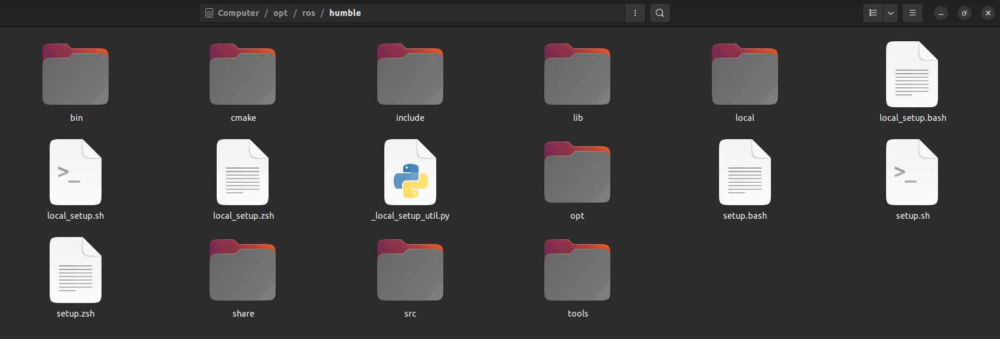

<!-- <center></center> -->

<style>
.back{
	position: fixed;
	width: 250px;
	height: 250px;
	top: 50%;
	left: 50%;
    margin-top: auto; 
    margin-left: auto; 
	opacity: 0.15;
    z-index: -1;
	}
</style>
<!--  -->

<center>
    <h1>ROS2 Ecosystem and Filesystem: A Comprehensive Guide</h1>
</center>

---

### Introduction

> The Robot Operating System (ROS) is a flexible framework for writing robot software. ROS2, the latest version, brings several improvements over its predecessor, including better support for real-time computing, enhanced security, and improved modularity. Understanding the ROS2 ecosystem and filesystem is crucial for effectively developing and managing robot applications. In this blog post, we'll explore the ROS2 underlay and overlay workspace environments, create a Colcon workspace, explain the build and install files, and create custom ROS2 packages using both Python and CMake.

### ROS2 Underlay and Overlay Workspace Environment

> *In ROS2, the concept of workspaces is essential for organizing and managing different projects and dependencies. There are two primary types of workspaces:*

1. **Underlay Workspace**: This is the base workspace where core ROS2 packages and other dependencies are installed. It serves as the foundation for overlay workspaces. Typically, this includes the installation of ROS2 itself and any third-party libraries that your project depends on. It is located inside the `/opt/ros/humble/` directory.

    

2. **Overlay Workspace**: This workspace sits on top of the underlay workspace. It is used for developing and testing your own packages. Overlay workspaces can be layered on top of each other, allowing for flexible development and testing environments. We will create an overlay workspace for the project in this tutorial below.

### Creating a Colcon Workspace

> Colcon is a command-line tool used to build, test, and package ROS2 applications. It is designed to work with multiple build systems and is essential for managing ROS2 workspaces. Here's how to create a Colcon workspace:

1. **Set Up Your Environment**: Ensure you have ROS2 and Colcon installed. You can install ROS2 following the instructions from the [ROS2 documentation](https://docs.ros.org/en/foxy/Installation.html) or previous module of this course [here](../introduction_installation/intro_install.md). Install Colcon using pip:

   ```bash
   pip install -U colcon-common-extensions
   ```

2. **Create the Workspace Directory**: Create a new directory for your workspace and navigate into it:

   ```bash
   mkdir -p ~/ros2_ws/src
   cd ~/ros2_ws
   ```

   > ***Tip:** You can name your workspace whatever you want. However, it is recommended to name it as per your project details.*

3. **Initialize the Workspace**: Use Colcon to initialize your workspace:

   ```bash
   colcon build
   ```

   This command will set up the necessary directories and files for your workspace.

### Build and Install File Explanation

When you build a ROS2 workspace using Colcon, several directories and files are generated:

- **build/**: This directory contains intermediate build files and artifacts for each package.
- **install/**: This directory contains the installed files for each package. It mimics the structure of the system's file hierarchy, making it easier to locate executables, libraries, and other resources.
- **log/**: This directory stores log files generated during the build and test processes.

> ***Note:** Whenever you make changes to your packages, you must re-build your workspace before running your applications and source your setup files to make your packages available.*

### Creating a Custom ROS2 Package (Python)

> *Creating custom packages is a fundamental part of developing with ROS2. Here's how to create a simple package using both Python and CMake.*

#### Creating a Python Package

1. **Create the Package**: Navigate to the `src` directory of your workspace and create a new package:

   ```bash
   cd ~/ros2_ws/src
   ros2 pkg create --build-type ament_python my_python_pkg
   ```

   This command creates a new directory `my_python_pkg` with the necessary files and directories.

2. **Package Structure**: The package structure will look like this:

   ```
   my_python_pkg/
   ├── package.xml
   ├── setup.cfg
   ├── setup.py
   └── my_python_pkg
       └── __init__.py
   ```

### Conclusion

> Understanding the ROS2 ecosystem and filesystem is crucial for effective robot software development. By mastering the concepts of underlay and overlay workspaces, creating Colcon workspaces, and building custom packages in Python , you can streamline your development process and create robust robotic applications. Whether you're a beginner or an experienced developer, these foundational skills will help you navigate the ROS2 environment with confidence.

</br>

-------