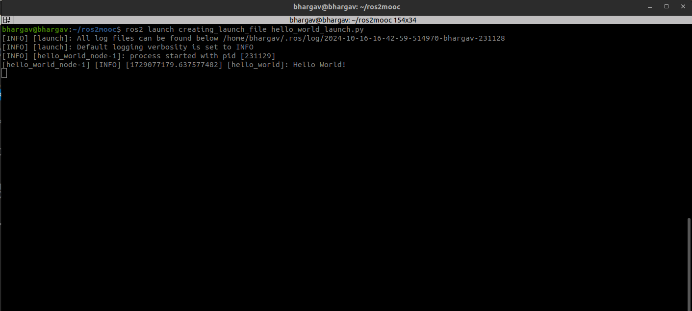

# Creating Launch File for Publisher and Subscriber node 

### Create a new package in the same workspace 
```
cd ~/ros2mooc/src
ros2 pkg create creating_launch_file --build-type ament_python
```
### Create a launch directory

Inside package creating_launch_file create a directory named launch:

```bash
mkdir -p ~/ros2_ws/src/creating_launch_file/launch
```

### Copy python file from hello_world to this package

cp ~/ros2_ws/src/hello_world/hello_world/hello_world_node.py ~/ros2_ws/src/creating_launch_file/


### Single Launch File

Create a new launch file named hello_world_launch.py inside the launch directory:

```bash
from launch import LaunchDescription
from launch_ros.actions import Node

def generate_launch_description():
    return LaunchDescription([
        Node(
            package='creating_launch_file',
            executable='hello_world_node',
            output='screen',
        ),
    ])
```


### Updated Directory Structure
Ensure your package has the following structure:

```bash
ros2mooc/
├──src/
   └── hello_world/
   └── task1/ 
   └── task2/ 
   └── creating_launch_file/
       ├── creating_launch_file/
       │   ├── __init__.py
       │   └── hello_world_node.py
       ├── resource/
       ├── test/
       ├── package.xml
       ├── setup.cfg
       └── setup.py
```

### setup.py

Ensure your setup.py includes both the publisher and subscriber nodes:

```bash
from setuptools import find_packages, setup
import os
from glob import glob
package_name = 'py_pubsub'

setup(
    name=package_name,
    version='0.0.0',
    packages=find_packages(exclude=['test']),
    data_files=[
        ('share/ament_index/resource_index/packages',
            ['resource/' + package_name]),
        ('share/' + package_name, ['package.xml']),
        (os.path.join('share', package_name, 'launch'), glob('launch/*.py')),
    ],
    install_requires=['setuptools'],
    zip_safe=True,
    maintainer='bhargav',
    maintainer_email='hsbhargav87@gmail.com',
    description='TODO: Package description',
    license='TODO: License declaration',
    tests_require=['pytest'],
    entry_points={
        'console_scripts': [
            'hello_world_node = creating_launch_file.hello_world_node:main'
        ],
    },
)
```
### Building and Running

1. Build the Package

2. Source the Workspace

3. Launch Node:

```bash
ros2 launch creating_launch_file hello_world_launch.py 
```
### Output

