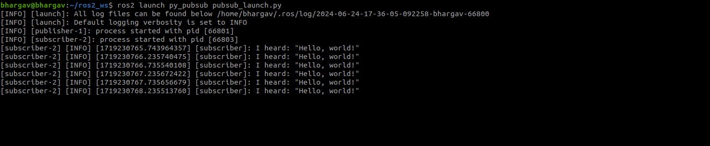

# Creating Launch File for Publisher and Subscriber node 

### Create a launch directory

Inside package py_pubsub create a directory named launch:

```bash
mkdir -p ~/ros2_ws/src/py_pubsub/launch
```
### Single Launch File

Create a new launch file named pubsub_launch.py inside the launch directory:

```bash
import os
from launch import LaunchDescription
from launch_ros.actions import Node

def generate_launch_description():
    return LaunchDescription([
        Node(
            package='py_pubsub',
            executable='publisher',
            name='publisher',
            output='screen',
            emulate_tty=True,  # This ensures the output is formatted correctly for the terminal
        ),
        Node(
            package='py_pubsub',
            executable='subscriber',
            name='subscriber',
            output='screen',
            emulate_tty=True,
        )
    ])
```


### Updated Directory Structure
Ensure your package has the following structure:

```bash
py_pubsub/
├── launch/
│   └── pubsub_launch.py
├── py_pubsub/
│   ├── __init__.py
│   ├── publisher.py
│   └── subscriber.py
├── package.xml
└── setup.cfg
└── setup.py
```

### setup.py

Ensure your setup.py includes both the publisher and subscriber nodes:

```bash
from setuptools import find_packages, setup
import os
from glob import glob
package_name = 'py_pubsub'

setup(
    name=package_name,
    version='0.0.0',
    packages=find_packages(exclude=['test']),
    data_files=[
        ('share/ament_index/resource_index/packages',
            ['resource/' + package_name]),
        ('share/' + package_name, ['package.xml']),
        (os.path.join('share', package_name, 'launch'), glob('launch/*.py')),
    ],
    install_requires=['setuptools'],
    zip_safe=True,
    maintainer='bhargav',
    maintainer_email='hsbhargav87@gmail.com',
    description='TODO: Package description',
    license='TODO: License declaration',
    tests_require=['pytest'],
    entry_points={
        'console_scripts': [
            'publisher = py_pubsub.publisher:main',
            'subscriber = py_pubsub.subscriber:main',
        ],
    },
)
```
### Building and Running

1. Build the Package

2. Source the Workspace

3. Launch Node:

```bash
ros2 launch py_pubsub pubsub_launch.py 
```


