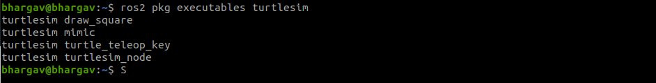
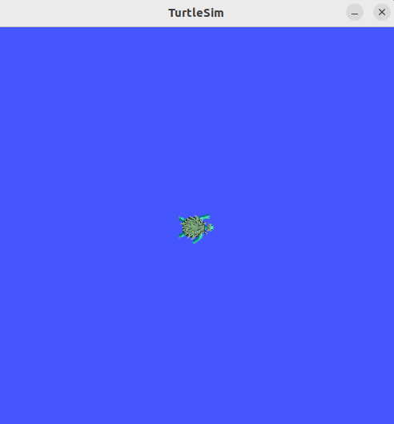
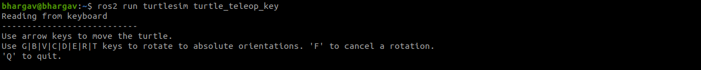

## Getting Started with the Turtle Simulator

### Install Turtlesim

First, update your package list and install Turtlesim:

```bash
sudo apt update
sudo apt install ros-humble-turtlesim
```

Check that the package is installed:
```bash
ros2 pkg executables turtlesim
```


### Start Turtlesim

To start Turtlesim, enter the following command in your terminal:
```bash
ros2 run turtlesim turtlesim_node
```
This will open the Turtlesim window where you can see the turtle.


### Move the Turtle
Open a new terminal and source ROS 2 again. Then run the teleoperation node to control the turtle:

```bash
ros2 run turtlesim turtle_teleop_key
```
Using your keyboard, you can now control the turtle's movement.


### List Nodes, Topics, and Services
You can see the nodes, and their associated topics, services, and actions, using the list subcommands of the respective commands:

```bash
ros2 node list
ros2 topic list
ros2 service list
ros2 action list
```

