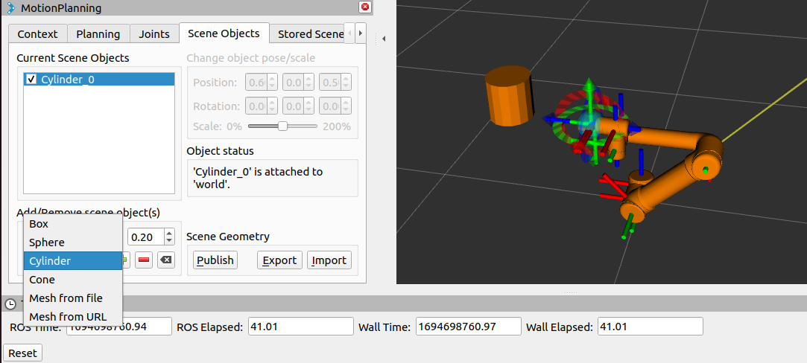

# Adding objects to the Planning Scene

- In MoveIt! Setup Assistant, you generated a collision matrix that prevents self-collision i.e it makes sure that the Motion Planning Algorithm does not plan a path in which the links of the Robotic Arm are colliding with each other.
- Robotic Manipulators typically are used to interact with the environment around them. We do not want the links of the manipulator to collide with its environment.
- To achieve this we can add objects in the Planning Scene of MoveIt! so that the Motion Planning Algorithm considers the object as an obstacle and plans a path to avoid this obstacle. 
- But, not all objects in the environment are obstacles. 
- Consider a Robot whose job is to pick a package from a shelf and place it in a box. 
- In this case the shelf should be considered an obstacle and the manipulator should not collide with it.

> In MoveIt! you can add the mesh files of such obstacles in the Planning Scene.

- On the other hand, the package on the shelf is not an obstacle. The end-effector of the arm needs to go to the package to pick it up. After picking up the package the arm needs to ensure that the package also does not collide with the shelf.

> In MoveIt! you can dynamically attach/detach objects to the end-effector. When attached, Motion Planners will then consider the object also in Motion Planning.

---

## Example
- Open up the rviz launch file which spawns UR5 with moveit.
- Go to the `Scene Objects` tab in the Motion Planning mini window within Rviz.
- Add any primitive object or select any STL file from you PC.
- You can set the pose by changing the values of position and rotation, OR even scale the object.
- Finally add the base frame by double-clicking on the checkbox of the object in the list, and it will prompt you to select the reference frame.
- After that click on `Publish` button to publish the same to the `Planning Scene`. So that the moveit understands that it is a collision while planning trajectory in the workspace.

##### For example the following image shows cylinder added in the workspace with respect to `world`.

---
## Practice Task
- Add the `rack.stl` file using `Mesh from file` and `+` button. You can find the `rack.stl` file from `pymoveit2/examples/assets` folder.
- Place the mesh in such a way that it matches the actual position of rack in `gazebo` world according to task 1B.

***HINT:** You can use point cloud to see the location of items in gazebo world within rviz from camera perspective*