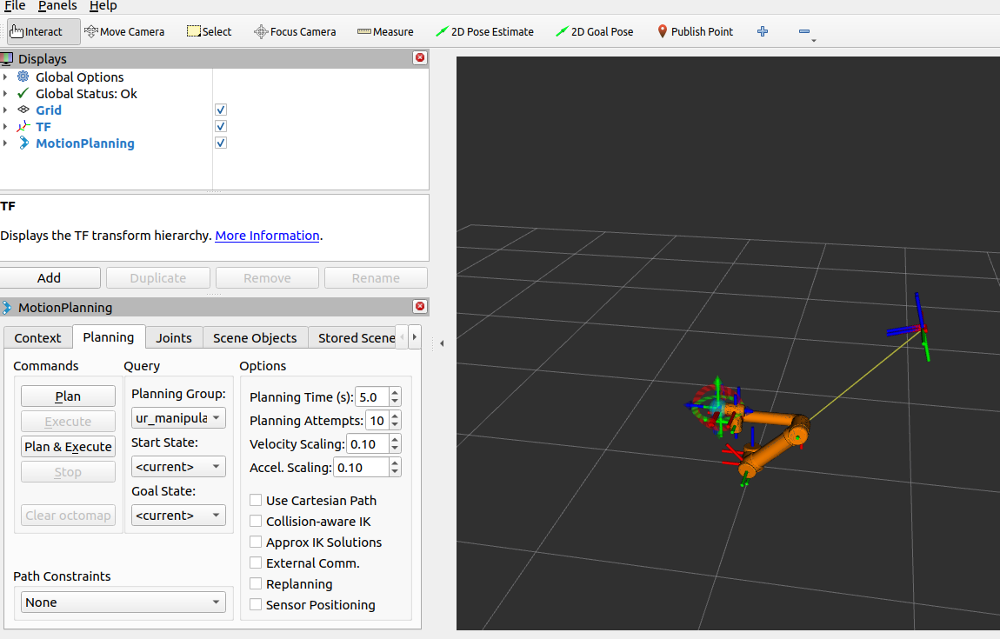

# Controlling UR5 using Rviz

As you have seen in the `moveit_rviz` section. We can now actuate the joints of UR5 arm using Rviz. We can also keep the arm in certain position and then let `moveit` plan and calculate the trajectory. To do the same, we have to launch two files.

> ***NOTE:** Make sure that you have sourced the workspace again after any changes to reflect the same in the terminal, OR restart your terminal assuming that the setup.bash is already added in the `.bashrc` file)*

- Start the gazebo launch spawner ready by using:
```sh
ros2 launch ur_description ur5_gazebo_launch.py
```

- Start the launch file you created in the previous section:
```sh
ros2 launch ur5_moveit spawn_ur5_launch_moveit.launch.py
```

After the launch make sure to add other visualization tools as shown in the image below:
