# Moveit Setup Assistant

> **NOTE:** [Moveit Setup Assistant Link for ROS 2 Humble](https://moveit.picknik.ai/humble/doc/examples/setup_assistant/setup_assistant_tutorial.html), there some typos in this webpage, make sure to verify the same with the following instructions. You can use the same for more clarity while creating the configuration for UR5. 


<!-- - MoveIt! Setup Assistant is a pretty handy tool which provides a GUI interface to configure a robotic arm for MoveIt. -->
<!-- - Following walkthrough videos will show you the steps to generate this ROS Package with MoveIt! configured. -->
The **MoveIt Setup Assistant** is a graphical user interface for configuring any robot for use with MoveIt. Its primary function is generating a Semantic Robot Description Format (SRDF) file for your robot, which specifies **additional information** required by MoveIt such as planning groups, end effectors, and various kinematic parameters. **Additionally**, it generates other necessary configuration files for use with the MoveIt pipeline. To use the MoveIt Setup Assistant, you will need to have a URDF file for your robot. [Source Link](https://moveit.picknik.ai/main/doc/examples/setup_assistant/setup_assistant_tutorial.html)

> *You can skip the steps which are not shown in the below information. We highly encourage you to surf internet for more detailed concepts.*

### 1. Start: 
(Make sure to source the workspace in terminal before starting this steps)
```sh
ros2 launch moveit_setup_assistant setup_assistant.launch.py
```
This command will open up a window having GUI of setup assistant
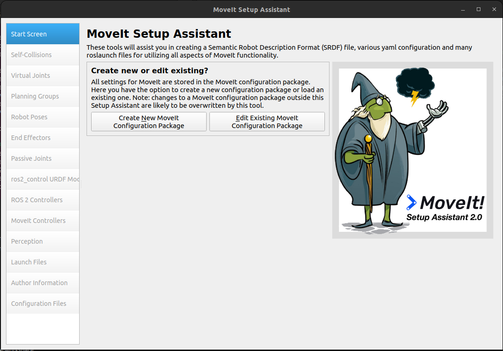

### 2. Select the URDF file of robotic arm
- Click on `Create New Moveit Configuration package`.
- Select the URDF file of the UR5 arm named as `ur5_arm.urdf.xacro` from the `ur_description/urdf` package. 
> **NOTE:** Make sure to only select **ur5_arm.urdf.xacro** and NOT any other xacro file.
- Click on `Load Files` button to load the same. This will open up a similar window:
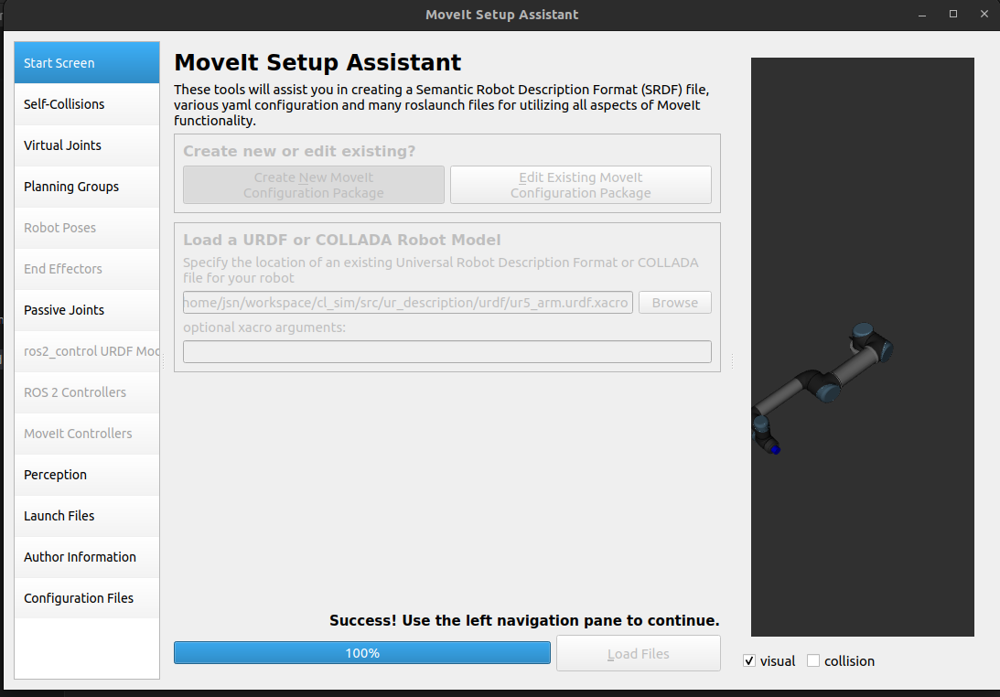

### 3: Generate Self-Collision Matrix
*(Make sure to keep the bar of `sampling density` to its maximum value.)*
- Click on the Self-Collisions pane selector on the left-hand side and click on the `Generate Collision Matrix` button. The Setup Assistant will work for a few second before presenting you the results of its computation in the main table.
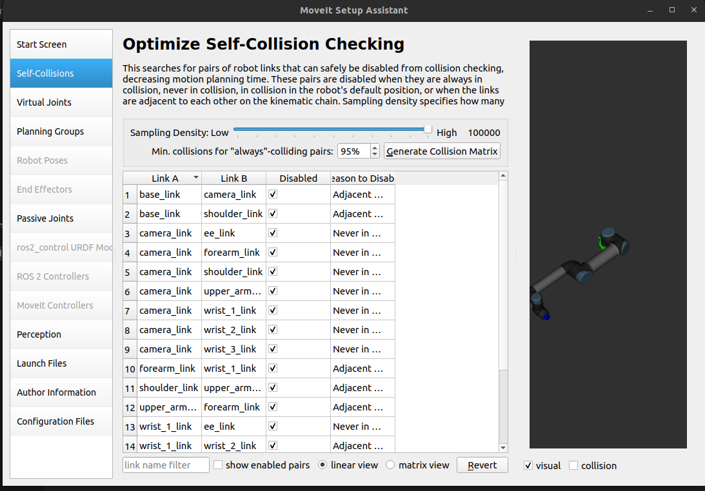

### 4. Add Virtual Joints
Virtual joints are used primarily to attach the robot to the world. We need to add two virtual joints:
- `FixedBase`: for `base_link` having parent link as `world`
- `CamBase`: for `camera_link` having parent link as `world`
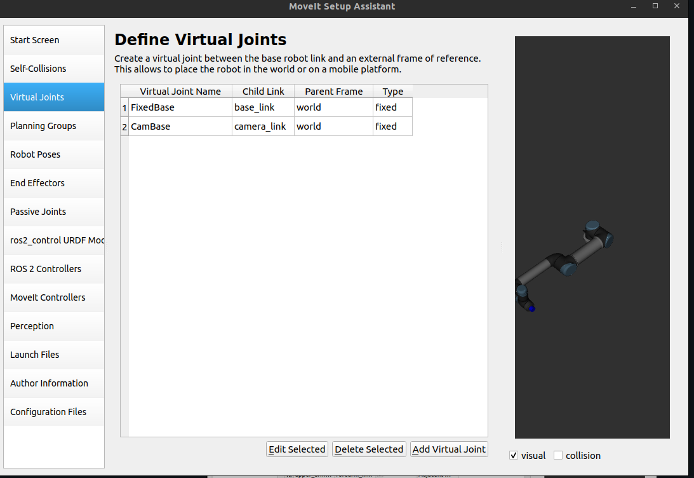

### 5. Add Planning Groups
Planning groups are used for semantically describing different parts of your robot, such as defining what an arm is, or an end effector.
- Click on `Add Group` button, make sure to keep the following details to resemble more with hardware:
    - Group Name: `ur_manipulator`
    - Kinematics solver: `KDLKinematicPlugin`
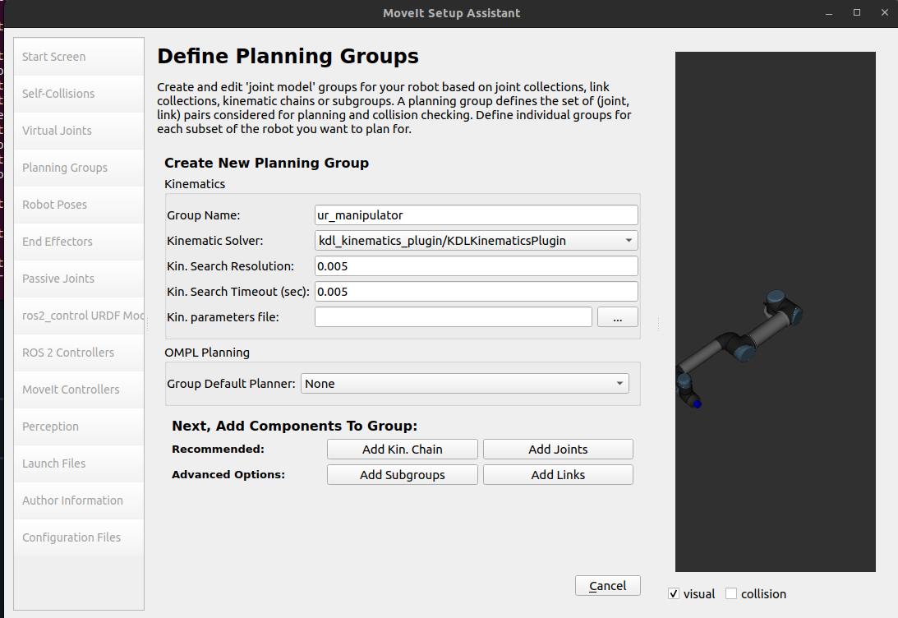

- Click on `Add Joints` and the following joints as shown in the image below by selecting in order and using `>` button.
- After adding, click on the `save` button.
    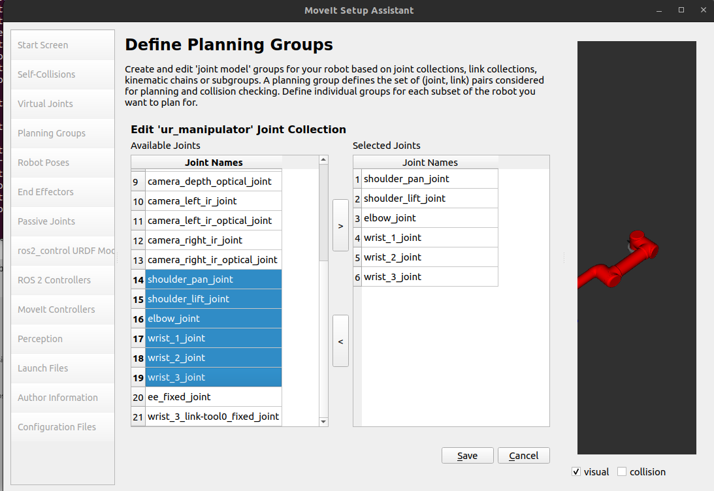

- Now add `links`, by double-clicking on `Links`.
    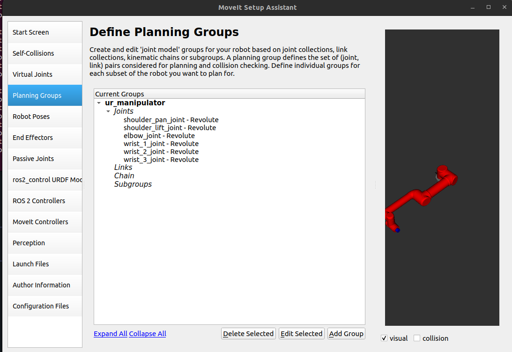

- Similar to the `Joints` step, add the links as shown in the image.
    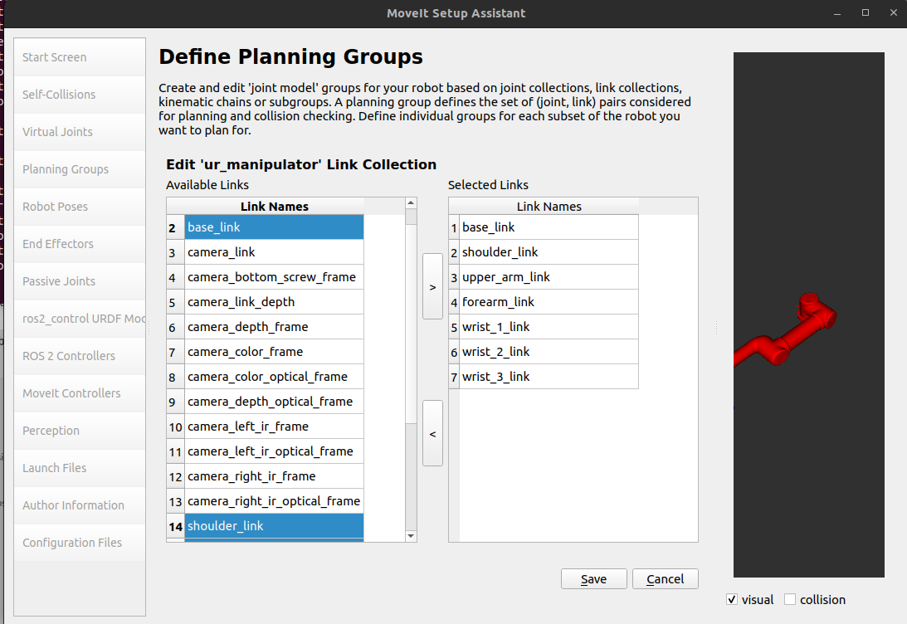

- Now add `chain` by double- clicking on `Chain`.
    - By extending each drop-down list you can reach the end of other links a shown below:
    - Select `Base_link` as `base_link`
    - Select `Tip Link` as `tool0`
    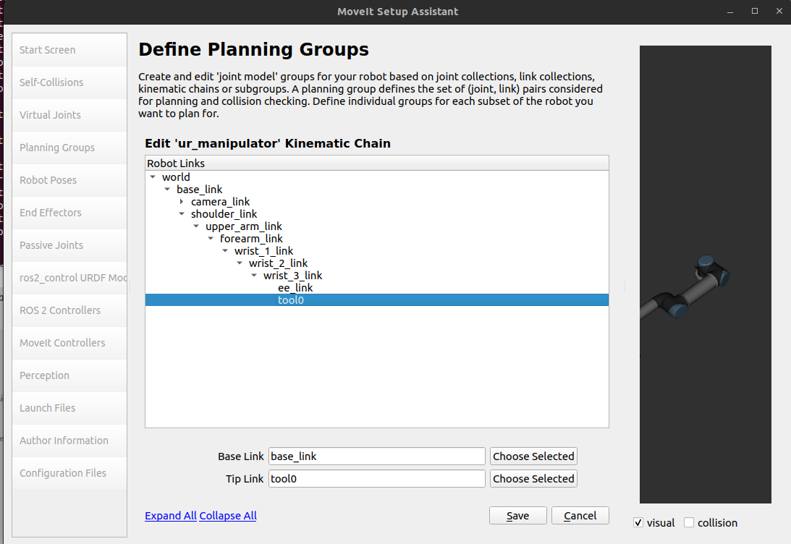

The final planning group setup will look like the follwoing window:
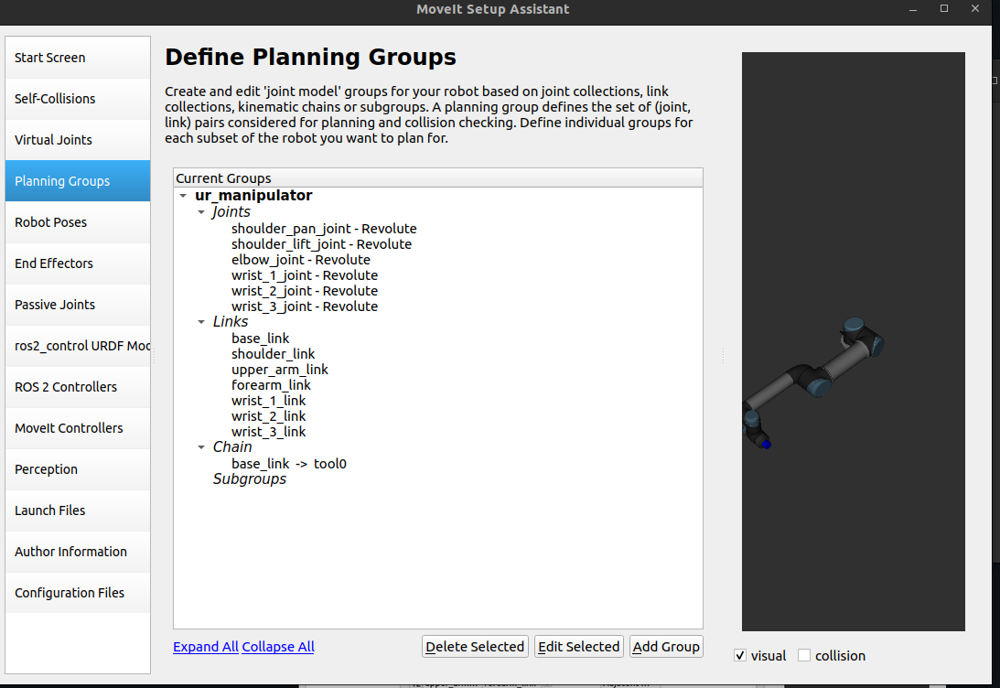

### 6. Label End Effectors
Now, we will designate end effectors name. By selecting `Add End Effector` make sure to keep the info as:
    - EEF Name: `gripper`
    - Select `Group Name`: `ur_manipulator`  # Same as the one you named in planning group
    - Parent Link: `tool0`
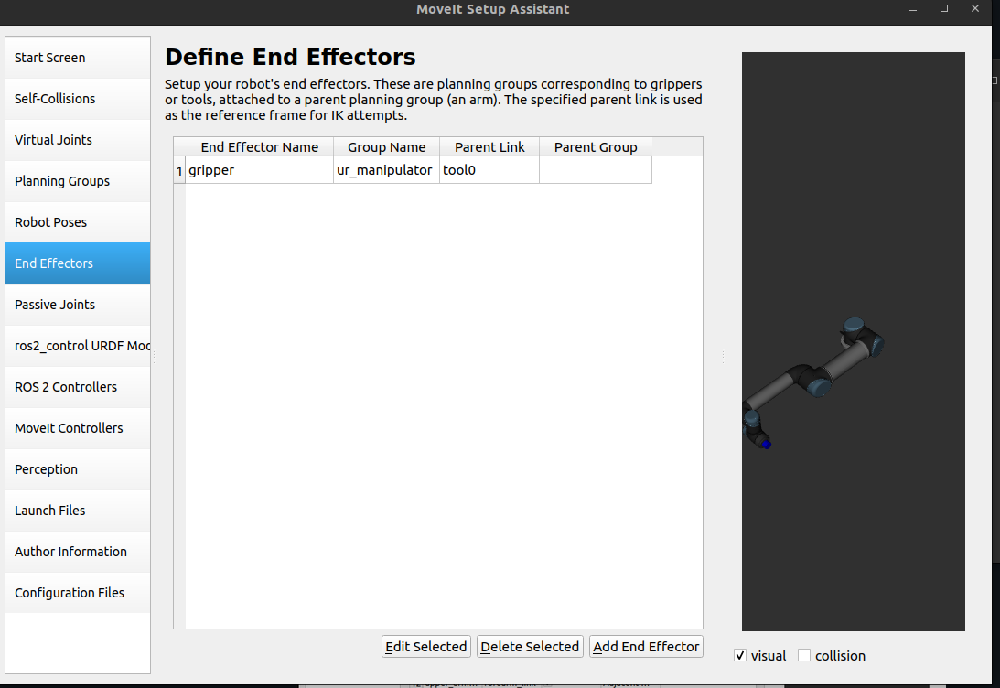

### 7. Checking ros2_control
Make sure that `ros2_control` has position for `command_interface` and position, velocity for `position_interface`.
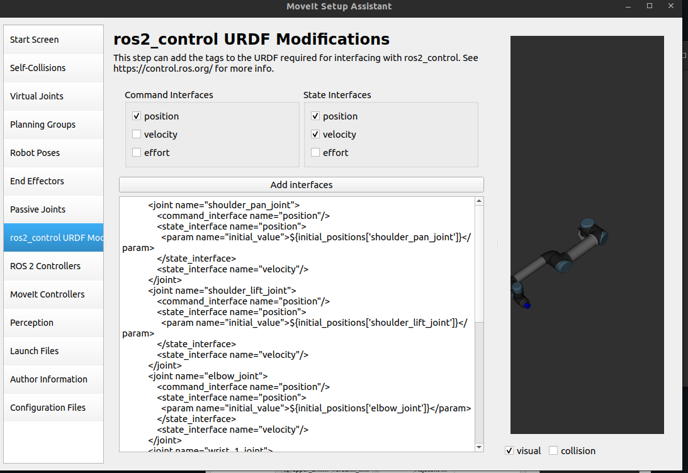

## 8. Add Author Information
*Skipping to the `Author Information` tab.*
Colcon requires author information for publishing purposes:
- Click on the Author Information pane.
- Enter your name and email address.

### 9. Generate Configuration Files
You are almost there. One last step - generating all the configuration files that you will need to start using MoveIt:
- Click on the Configuration Files pane.
- Choose a location and name for the ROS package that will be generated containing your new set of configuration files. 
- Click browse, navigate inside your `src` folder. 
- Click Create New Folder, call it `ur5_moveit`, and click Choose.

Click on the Generate Package button. The Setup Assistant will now generate and write a set of launch and config files into the directory of your choosing. All the generated files will appear in the Generated Files/Folders tab and you can click on each of them for a description of what they contain. Finally you can exit the setup assistant.

---

###### Congratulations!! - You are now done generating the configuration files you need for MoveIt