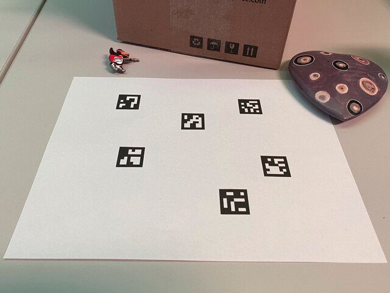

### Here are some resources for you to learn computer vision using OpenCV library

- [Learn how to use OpenCV with python](https://docs.opencv.org/4.x/d6/d00/tutorial_py_root.html)

- [Learn how to use OpenCV with ROS](https://wiki.ros.org/cv_bridge/Tutorials/ConvertingBetweenROSImagesAndOpenCVImagesPython)

- [Learn about ARUCO markers and how to detect them in OpenCV](https://docs.opencv.org/4.x/d5/dae/tutorial_aruco_detection.html)

### To install library-

#### Install "pip3" (which we have already installed in task 0 before, so no need to do it again)
```sh
sudo apt install python3-pip
```

#### Install "OpenCV2 Python and Numpy"
```sh
pip3 install opencv-contrib-python==4.7.0.72
pip3 install numpy==1.21.5
```

> **Note: We suggest that you should use above mentioned versions for opencv-contrib-python and numpy as they are tested to be stable for this theme, but you may choose other version only if you are confident to do so. Doing so, will not guarantee support from e-Yantra team.**


### Localization using ARUCO Image Pixels

Images are array of pixels, hence objects in an image are also "**set of pixels**" 



An ARUCO marker, when viewed in an image, is a **Quadrilateral** shape defined by some set of pixels.  We can refer to that shape by different ***properties*** of the shape, like: **corners**, **area**, **length of sides**, **diagonals**, **medians**, **bisectors** and what not !

> By looking into the image shown above, you would know why I refered to **Quadrilaterals** instead of **Squares**

#### The Idea is,
- To **use OpenCV to find** some **properties of the** ARUCO marker **position** and **orientation**.
- Apply your logic to find pose of aruco to publish transform between aruco object and base_link of robot arm.

> One good & mostly enough resource : [This Wikipedia Page](https://en.wikipedia.org/wiki/Quadrilateral)