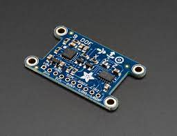
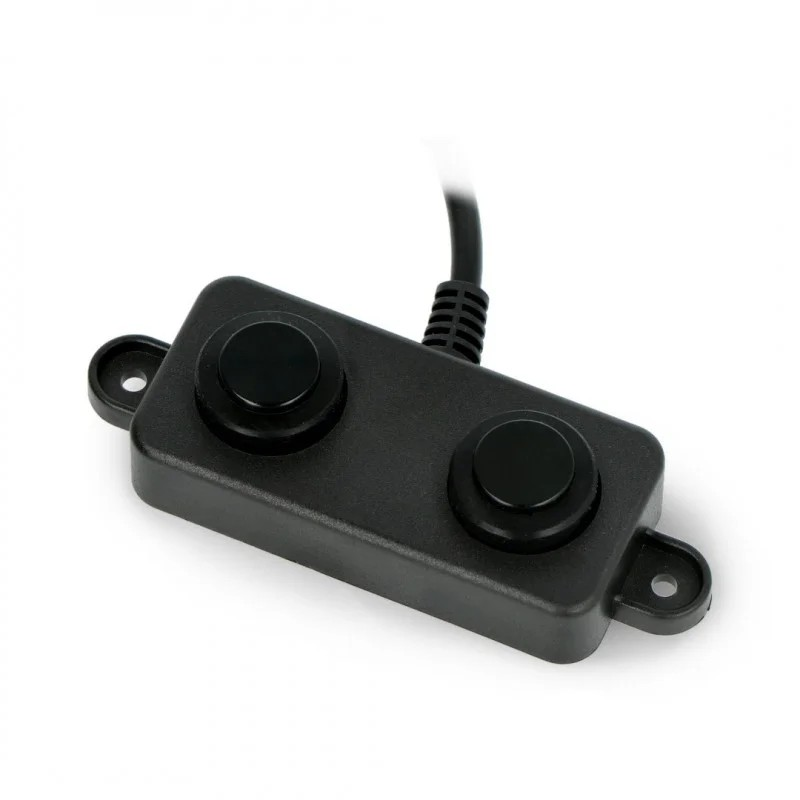

# eBot Description

**eBot:**

eBot is a four-wheeled robot that works on a Differential drive control mechanism. eBot consists of various sensors such as _encoders_, _2D LIDAR_, an _IMU_ and couple of ultrasonic sensors.

**2D LiDAR:**

The following are the features of the 2D LiDAR sensor used in an eBot:

1. Working range of 0.5m to 20m.

2. Scanning angle of 270 degrees.

> The LiDAR data are published on topic `/scan`

   

**IMU**

An Inertial Measurement Unit (IMU) is a device that can measure and report specific gravity and angular rate of an object to which it is attached.

> The IMU data are published on topic `/imu`

**Ultrasonic Sensor**

An ultrasonic sensor is an instrument that measures the distance to an object using ultrasonic sound waves. We will be using it on our eBot for docking and safety purpose.

> The IMU data are published on topic `/ultrasonic_rl/scan` and `/ultrasonic_rr/scan`

