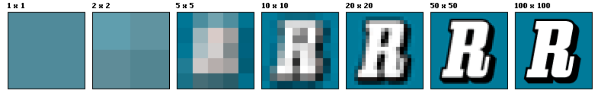
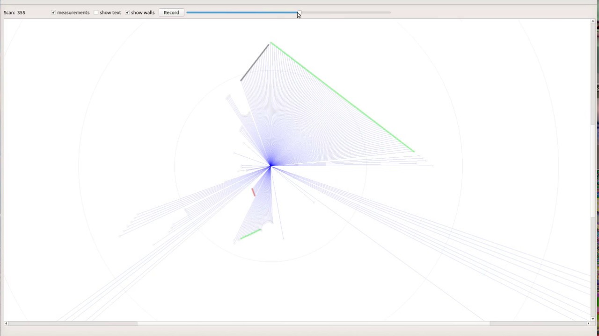
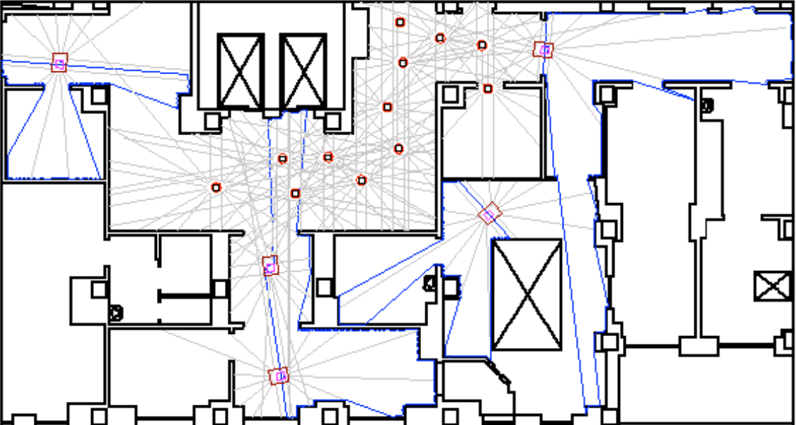
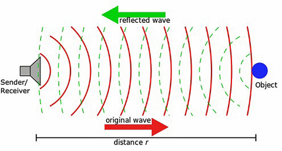

# Exteroceptive Sensor

## Camera 

> Comparison metrics :
>
> * Resolution
> * Field of view
> * Dynamic range 

- We start with the most common and widely used sensor, _the camera_ !!!.

- Cameras are a passive, light-collecting sensor that are great at capturing rich, detailed information about a scene. Some believe that the camera is the only sensor truly required for any system. But state of the art performance is not yet possible with vision alone.

- Comparison metrics:

  - *Resolution*: The resolution is the number of pixels that create the image.Below you'll see an image with various resolutions.

      <!-- 

      
      
 -->

      
      

    > An image of resolution, 1920 x 1080 will have a total of 2073600 pixels.

  - *Field of view* (FOV): The field of view is defined by the horizontal and vertical angular extent that is visible to the camera, and can be varied through lens selection and zoom. 

      <!-- 

      
      
  -->

      

      > Note: The page [Angle of View](https://en.wikipedia.org/wiki/Angle_of_view) describes a formula to calculate FOV. However, this same formula can also be used to calculate the depth of an object given FOV and focus length. Do keep this in mind in later perception task.

  - *Dynamic Range*: 

    - The dynamic range of the camera is the difference between the darkest and the lightest tones in an image.

    - There is an important trade off in cameras and lens selection, that lies between the choice of FOV and resolution. Wider field of view permit a lager viewing region in the environment. But fewer pixels that absorb light from one particular object.
    - As the field of view increases, we need to increase resolution to still be able to perceive with the same quality, the various kinds of information we may encounter. Other properties of cameras that affect perception exist as well, such as focal length, depth of field and frame rate.

## Stereo Camera

> Comparison metrics :
>
> * Field of view
> * Depth perception

- The combination of two cameras with overlapping fields of view and aligned image planes is called the stereo camera.

- **Stereo cameras allow depth estimation from synchronized image pairs.** Pixel values from image can be matched to the other image producing a disparity map of the scene. This disparity can then be used to estimate depth at each pixel.

<!-- 

  

 -->

> Quick detailed working of stereo imaging can be obtained from this website: [Introduction to Stereo Imaging](https://users.cs.cf.ac.uk/Dave.Marshall/Vision_lecture/node11.html) 

## LIDAR

> Comparison metrics :
>
> * Number of beams
> * Points per second
> * Rotation rate
> * Field of view

- LIDAR sensing involves shooting light beams into the environment and measuring the reflected return. 

<!-- 

  

 -->

- By measuring the amount of returned light and time of flight of the beam. Both in intensity w.r.t to the range of the reflecting beam, object distance is be estimated. 

- LIDAR usually include a spinning element with multiple stacked light sources. And outputs a three dimensional point cloud map, which is great for assessing scene geometry. 

- Because it is an active sensor with it's own light sources, LIDAR sensors are not effected by the environments lighting. So LIDAR do not face the same challenges as cameras when operating in poor or variable lighting conditions.

> LIDAR used in ebot is 2D LIDAR, meaning, from your experience from Task 1, it doesn't gives a 3D point cloud but a range of values about object's distance around it. From the below image, you can see the wall or obstacles boundaries perceive by a 2D LIDAR.  

<!-- 

	

 -->

> Using this 2D LIDAR or as we know from the Gazebo's plugin as laser scanner, a map as shown in the example below can be generated.

<!-- 

  

   -->

- Comparison metrics:

  - *Number of beams*: The first is the number of sources it contains with 8, 16, 32, and 64 being common sizes.
  - *Points per second*: more the value, faster the point collection. Hence, the more detailed the 3D point cloud can be.
  - *Rotation rate*: The higher this rate, the faster the 3D point clouds are updated.
  - *Field of view*, which once again, is the angular extent visible to the LIDAR sensor

  

## RADAR (Radio Detection and Ranging)

> Comparison metrics
>
> * range
> * field of view
> * position and speed accuracy

- RADAR sensors have been around longer than LIDAR and robustly detect large objects in the environment. 

- They are particularly useful in adverse weather as they are mostly unaffected by precipitation. 

<!-- 

  

 -->

- Comparison metrics:
  - *Range & FOV*: RADAR typically have, wide angular field of view but short range. Or a narrow field of view but a longer range

## Ultrasonic / Sonars

- Sonar are short range, inexpensive ranging devices. 

- An ultrasonic sensor is an electronic device that measures the distance of a target object by emitting ultrasonic sound waves, and converts the reflected sound into an electrical signal.

- Another great thing about sonar is that they are low-cost. Moreover, just like RADAR and LIDAR, they are unaffected by lighting and precipitation conditions. Sonar is selected based on a few key metrics. The maximum range they can measure, the detection field of view, and their cost.

<!-- 

  

 -->
