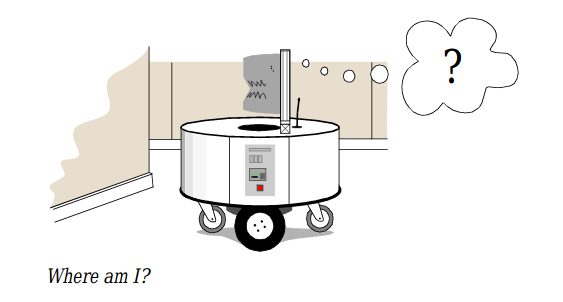
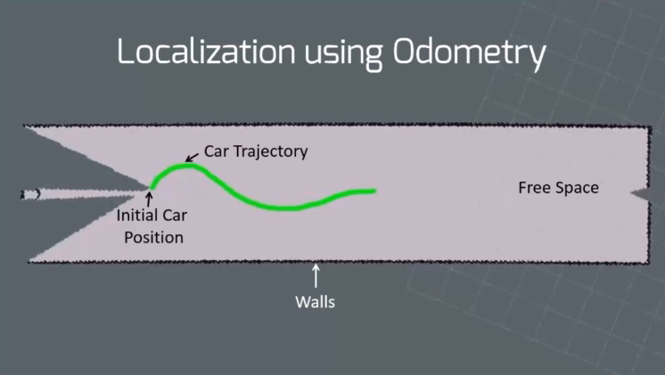

# Localization

Robot localization is the process of determining where a mobile robot is located with respect to its environment.

<!-- 

	

 -->

<!--  -->

Localization involves estimating position and orientation of vehicle i.e. the pose of the robot as it moves and senses the environment.

One way of knowing the position of the robot is tracking from its initial positon. 

By measuring the wheel odometry reading of the robot we can calculate the distance travelled from the intial position and predict with certainty of the cars pose on the map.

<!--  -->

## Drawbacks of localization using wheel odometry

1. **The method of odometry measurement is not accurate.**

2. **Does not account for wheel slipage.**

   Due to high torque of motor the wheel spins at the same location even before the car starts to move. The odometry believes the car is moving even though the wheel is spinning at the same location. 

## The Challenge of Localization

1. If one could attach an accurate GPS(Global Position System) sensor to a mobile robot, much of the localization problem would be obviated.  
2. The existing GPS network provides accuracy to within several meters, which is unacceptable for localizing human-scale mobile robots as well as miniature mobile robots such as desk robots and the body-navigating nano-robots of the future. 
3. Furthermore,GPS technologies cannot function  indoors or in  obstructed areas and are thus limited in their workspace.

## Solution

The issues that we see in localization :

1.  mistake committed by odometry, 
2.  solution to compensate for lack of initial position.

One solution to this issue is **Monte Carlo Localization** which uses particle filter. We will be using Adaptive Monte Carlo Localization technique to localizie using ROS2 in the next section.

Other alternative options include **Kalman Filter, Topological Markov Localization**

> Love Maths and want to know more about this, have a [read here](https://onlinelibrary.wiley.com/doi/full/10.1002/047134608X.W8318)