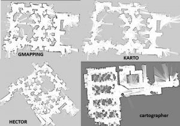

# Mapping

* A map is a representation of the environment where the robot is operating. It should contain enough information to accomplish a task of interest.

* There are different ways to represent a map
	1. Metric
		- Feature based 
		- Grid based 
		- Hybrid  
	2. Topological 
	3. Hybrid

* In order to create a map it is necessary to merge the measurements from previous positions and also keep a track of current measurements and the pose of the bot as they are changing. 

* To overcome this problem we use a technique called Simultaneous Localization and Mapping(SLAM). It estimates the map of the environment and the trajectory of a moving device using a sequence of sensor measurements. 

* There are a lot of SLAM algorithms around. To name a few, Gmapping, Hector mapping, Cartogrpaher, Rtab mapping etc.
Here is a little comparison,

Here is an example of mapping using `slam-toolbox` by nav2 stack, we will be learning to do it in the next section:

