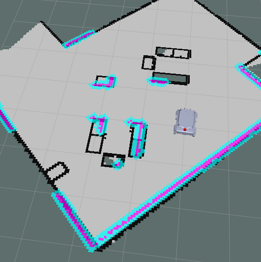

# Components of Nav2

## 1. Costmaps


* Cost map is a grid in which every cell gets assigned a value (cost) determining distance to obstacle, where higher value means closer distance.


* Using this map, the robot plans the path in such a way that it avoids obtsacles by creating a trajectory with lowest cost. 


* There are 2 costmaps, one for local planner which determines obtsacles near the robot and the other one for global planner to plan a global path from the start point to the goal with keeping the obstacles in mind. 


### 1.1 Local Costmap 

* These are the parameters used by a local cost map in `nav2_parma.yaml` in dir `/ebot_nav2/params/`. 

```
local_costmap:
  local_costmap:
    ros__parameters:
      update_frequency: 5.0
      publish_frequency: 2.0
      global_frame: odom
      robot_base_frame: "base_footprint"
      use_sim_time: True
      rolling_window: true
      width: 3
      height: 3
      resolution: 0.05
      footprint: "[ [0.21, 0.195], [0.21, -0.195], [-0.21, -0.195], [-0.21, 0.195] ]"
      plugins: ["voxel_layer", "inflation_layer"]
      inflation_layer:
        plugin: "nav2_costmap_2d::InflationLayer"
        cost_scaling_factor: 3.0
        inflation_radius: 0.55
      voxel_layer:
        plugin: "nav2_costmap_2d::VoxelLayer"
        enabled: True
        publish_voxel_map: True
        origin_z: 0.0
        z_resolution: 0.05
        z_voxels: 16
        max_obstacle_height: 2.0
        mark_threshold: 0
        observation_sources: scan
        scan:
          topic: /scan
          max_obstacle_height: 2.0
          clearing: True
          marking: True
          data_type: "LaserScan"
          raytrace_max_range: 3.0
          raytrace_min_range: 0.0
          obstacle_max_range: 2.5
          obstacle_min_range: 0.0
      static_layer:
        map_subscribe_transient_local: True
      always_send_full_costmap: True
  local_costmap_client:
    ros__parameters:
      use_sim_time: True
  local_costmap_rclcpp_node:
    ros__parameters:
      use_sim_time: True
```




### 1.2 Global Costmap


* These are the parameters used by a global cost map in `nav2_parma.yaml` in dir `/ebot_nav2/params/`.

```
global_costmap:
  global_costmap:
    ros__parameters:
      update_frequency: 1.0
      publish_frequency: 1.0
      global_frame: map
      robot_base_frame: "base_footprint"
      use_sim_time: True
      robot_radius: 0.3
      resolution: 0.05
      track_unknown_space: true
      plugins: ["static_layer", "obstacle_layer", "inflation_layer"]
      obstacle_layer:
        plugin: "nav2_costmap_2d::ObstacleLayer"
        enabled: True
        observation_sources: scan
        scan:
          topic: /scan
          max_obstacle_height: 2.0
          clearing: True
          marking: True
          data_type: "LaserScan"
          raytrace_max_range: 3.0
          raytrace_min_range: 0.0
          obstacle_max_range: 2.5
          obstacle_min_range: 0.0
      static_layer:
        plugin: "nav2_costmap_2d::StaticLayer"
        map_subscribe_transient_local: True
      inflation_layer:
        plugin: "nav2_costmap_2d::InflationLayer"
        cost_scaling_factor: 3.0
        inflation_radius: 0.55
      always_send_full_costmap: True
  global_costmap_client:
    ros__parameters:
      use_sim_time: True
  global_costmap_rclcpp_node:
    ros__parameters:
      use_sim_time: True
```


## 2 Planner


* There are 2 types of planners in the Navigation stack:
	1. Local Planner - Global planner plans the path from the start to the end goal. 
	2. Global Planner - Local planner is used to avoid obstacles and get the robot back to the global path after avoiding obstacles. 


### 2.1 Local Path Planner


* The purpose of local planner is to find a suitable local plan at every instance.


* There are various local planners that are used. We will be using the dwa local planner. 


*  Using a map, the planner creates a kinematic trajectory for the robot to get from a start to a goal location. 


* Along the way, the planner creates, at least locally around the robot, a value function, represented as a grid map. 


* This value function encodes the costs of traversing through the grid cells. The controller's job is to use this value function to determine dx,dy,dtheta velocities to send to the robot.


* The basic idea of the Dynamic Window Approach (DWA) algorithm is as follows:
	1. Discretely sample in the robot's control space (dx,dy,dtheta)
	2. For each sampled velocity, perform forward simulation from the robot's current state to predict what would happen if the sampled velocity were applied for some (short) period of time.
	3. Evaluate the cost of each trajectory resulting from the forward simulation, using a metric that incorporates characteristics such as: distance to obstacles, distance to the goal, distance to the global path, and speed. Discard the trajectories those that collide with obstacles.
	4. Pick the minimum cost trajectory and send the associated velocity to the mobile base.
	5. Rinse and repeat.


### 2.2 Global Path Planner


* The purpose of global path planner is to plan the shortest path which avoids all the obstacle from the start point to the goal point.


* There are a lot of various path planers used such as Djiktstras, D star, potential field but the one we are gonna focus on is A* 


* A star is a grid-based algorithm. It uses the global costmap provided to find the fastest path to the goal point without hitting any obstacle


* These are the parameters related to planner in `nav2_parma.yaml` in dir `/ebot_nav2/params/`.

```
planner_server:
  ros__parameters:
    expected_planner_frequency: 20.0
    use_sim_time: True
    planner_plugins: ["GridBased"]
    GridBased:
      plugin: "nav2_navfn_planner/NavfnPlanner"
      tolerance: 0.5
      use_astar: false
      allow_unknown: true

planner_server_rclcpp_node:
  ros__parameters:
    use_sim_time: True
```

## Controller Server

**The Dynamics of the bot are controller using this, so this one is very important**

* These are the parameters related to Control Server in `nav2_parma.yaml` in dir `/ebot_nav2/params/`.
```
controller_server:
  ros__parameters:
    use_sim_time: True
    controller_frequency: 20.0
    min_x_velocity_threshold: 0.001
    min_y_velocity_threshold: 0.5
    min_theta_velocity_threshold: 0.001
    failure_tolerance: 0.3
    odom_topic : "/odometry/filtered"
    progress_checker_plugin: "progress_checker"
    goal_checker_plugins: ["general_goal_checker"] # "precise_goal_checker"
    controller_plugins: ["FollowPath"]

    # Progress checker parameters
    progress_checker:
      plugin: "nav2_controller::SimpleProgressChecker"
      required_movement_radius: 0.5
      movement_time_allowance: 10.0

    general_goal_checker:
      stateful: True
      plugin: "nav2_controller::SimpleGoalChecker"
      xy_goal_tolerance: 0.25
      yaw_goal_tolerance: 0.25
    # DWB parameters
    FollowPath:
      plugin: "dwb_core::DWBLocalPlanner"
      debug_trajectory_details: True
      min_vel_x: 0.0
      min_vel_y: 0.0
      max_vel_x: 0.26
      max_vel_y: 0.0
      max_vel_theta: 1.0
      min_speed_xy: 0.0
      max_speed_xy: 0.26
      min_speed_theta: 0.0

      acc_lim_x: 2.5
      acc_lim_y: 0.0
      acc_lim_theta: 3.2
      decel_lim_x: -2.5
      decel_lim_y: 0.0
      decel_lim_theta: -3.2

      vx_samples: 20
      vy_samples: 5
      vtheta_samples: 20

      sim_time: 1.7
      linear_granularity: 0.05
      angular_granularity: 0.025
      transform_tolerance: 0.2
      xy_goal_tolerance: 0.25
      trans_stopped_velocity: 0.25
      short_circuit_trajectory_evaluation: True
      stateful: True

      critics: ["RotateToGoal", "Oscillation", "BaseObstacle", "GoalAlign", "PathAlign", "PathDist", "GoalDist"]
      
      BaseObstacle.scale: 0.02

      PathAlign.scale: 32.0
      PathAlign.forward_point_distance: 0.1

      GoalAlign.scale: 24.0
      GoalAlign.forward_point_distance: 0.1

      PathDist.scale: 32.0
      GoalDist.scale: 24.0

      RotateToGoal.scale: 32.0
      RotateToGoal.slowing_factor: 5.0
      RotateToGoal.lookahead_time: -1.0
      
controller_server_rclcpp_node:
  ros__parameters:
    use_sim_time: True
```

> ## To tune all this parameters, here is the brief [guide](https://navigation.ros.org/tuning/index.html)