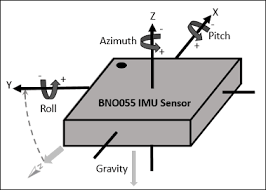
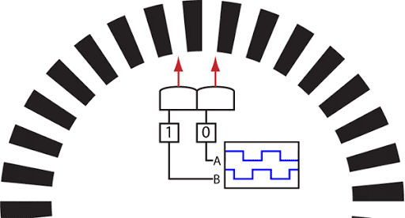
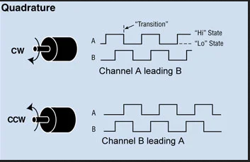

# Proprioceptive Sensor

> Direct measure of ego robot states
>
> * position,velocity\(GNSS\)
> * Varying accuracies : RTK,PPP,DGPS
> * angular rotation rate\(IMU, Position Encoder \)
> * acceleration\(IMU\)
> * heading\(IMU,GPS\)

## GNSS (Global Navigation Satellite Systems) / GPS (Global Positioning System) 

- GNSS receivers are used to measure ego robot's position, velocity, and sometimes heading.

- Our location (only the latitude and longitude) are calculated using one of the localization concept, called as [Trilateration](https://en.wikipedia.org/wiki/True-range_multilateration) 

- However, this information is not always available due to some reason. Example, signal attenuation inside tunnels. The accuracy depends a lot on the actual positioning methods and the corrections used. Hence, IMU sensor are utilized along with GPS for more robust estimation of 3D orientation.

## IMU

- An Inertial Measurement Unit (IMU) is a device that is mounted in a fixed position within the body of your robot. 

- It needs to be in a fixed position of the robot, so that it is aware of where its anchored placement is. From this fixed position within the robot, the IMU will keep track of the movement and position of itself. 

- Usually consisting of several gyroscopes and accelerometers, the IMU provides to the controller of the robot an indication of the pitch, roll, and heading of itself (these are referred to as rotational parameters as sourced by the gyroscopes), and also tracks the linear acceleration of the robot (that’s by the accelerometers).

- **The IMU cannot tell the robot where the it is per se. Instead, the IMU can tell what has happened in terms of movement and position on a relative basis from some starting point. The IMU is providing the angular velocity and linear acceleration, which can be used to calculate where it is, relative to where it was.**

<!-- 

  

 -->

## Position Encoder

- A Position Encoder are also called *odometry* sensors. 

- This sensor tracks the wheel rates of rotation, and uses these to estimate the speed and heading rate of change of the ego robot. This is the same sensor that tracks the mileage on your vehicle.

- The optical encoder has an LED light source, a light detector, a “code” disc/wheel mounted on the shaft, and output signal processor, refer the figure below. The disc has alternating opaque and transparent segments and is placed between the LED and detector so it intermittently interrupts the LED’s beam as it rotates. The detector responds to the series of light pulses it receives and sends that information to the processor, which actually extracts the motion information (amount of rotation).

<!-- 

  

 -->

- Simple encoder will give you count/speed, where as, Quadrature encoder will also provide direction information. 

<!-- 

  

 -->

- Look at phase of signals from the two bands on the encoder, and how the directionality is obtained.

<!-- 

  

 -->

>  More about Position encoders can be referred from slides 27-47 from [PPT](https://spacecraft.ssl.umd.edu/academics/788XF14/788XF14L15/788XF14L15.sensors_actuatorsx.pdf)

-----------

## Sensor Fusion

GNSS/GPS, IMU or Position encoder if used individual might not always be correct information regarding robot's pose. However, when used together, are found more accurate as they complement each others drawback. But the question is how one is suppose to utilised all of this information together and make sense out of it. This **sensor fusion** is done with the help of [Kalman Filter](https://www.youtube.com/playlist?list=PLX2gX-ftPVXU3oUFNATxGXY90AULiqnWT) or Extended Kalman filter. 

> Watch the below video to get an idea of Why and How sensor fusion is done...

<iframe width="824" height="476" src="https://www.youtube.com/embed/mwn8xhgNpFY" frameborder="0" allow="accelerometer; autoplay; clipboard-write; encrypted-media; gyroscope; picture-in-picture" allowfullscreen></iframe>
