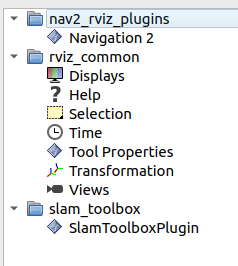
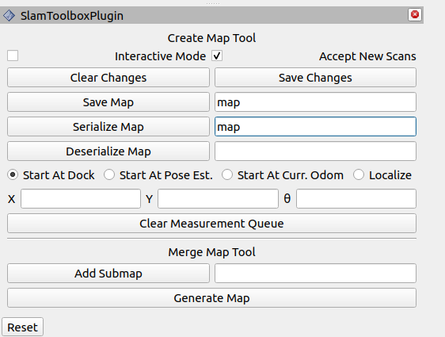

# Mapping - Saving the map
---

#### 1. Try to build the map without any empty cell in the arena or in the middle.
	
* Finally, congrats you have made you first map. Let's save it.

#### 2. Go to `RViz`, here you see `Panals` in that you will get `Add New Panals`

<div style="text-align:center"></div>

* Select `SlamToolboxPlugin` under `slam_toolbox`

#### 3. Just enter `map` or your map name in both first 2 rows and click on both `Save Map` and `Seriallize Map`

<div style="text-align:center"></div>

* This will save the map in your opened directry i.e. `/colcon_ws/`

#### 4. Here you will find 4 files named `map.data`, `map.pgm`, `map.posegraph` and `map.yaml`

* Just copy that in the pkg `ebot_nav2` i.e. `/ebot_nav2/maps/`


#### 5. Update the map name in `ebot_bringup_launch.py` launch file in dir `/ebot_nav2/launch/`.

```sh
	declare_map_yaml_cmd = DeclareLaunchArgument(
        'map',
        default_value=os.path.join(ebot_nav2_dir, 'maps', 'map_name.yaml'),  ## Update the map config here
        description='Full path to map yaml file to load')
```


#### 6. Update the map name in `nav2_params.yaml` launch file in dir `/ebot_nav2/params/`.

```sh
	map_server:
    ros__parameters:
    use_sim_time: True
    yaml_filename: "map_name.yaml"  ## Update the map name here
```

#### 7. Since we added map files in the ebot_nav2 pkg, we have to rebuild it.

```sh
	colcon build
```

OR

```sh
	colcon build --symlink-install
```
> Why to rebuild ?? Google it !