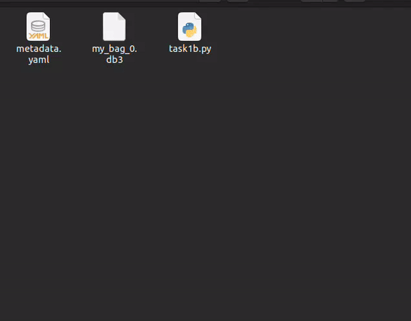

<style>
.back{
	position: fixed;
	width: 250px;
	height: 250px;
	top: 50%;
	left: 50%;
    margin-top: auto; 
    margin-left: auto; 
	opacity: 0.15;
    z-index: -1;
	}
</style>
<!--  -->

<center>
    <h1>Task 1B - Submission</h1>
</center>

---

## Submission instructions for task 1B:

> * ***NOTE:** All your tasks will be checked using a plagiarism software. If any submitted file is found to be plagiarised, e-Yantra reserves the right to disqualify the team.*

1. Upgrade your `eyantra-autoeval` package by running the command given below

    ```sh
    pip3 install -U eyantra-autoeval
    ```

2. First launch the robot in gazebo as instructed before `ros2 launch ur_description ur5_gazebo_launch.py` and `ros2 launch ur5_moveit spawn_ur5_launch_moveit.launch.py` keep it running *(Replace the package name of `ur5_moveit` if you have named it differently)* .

3. Then open a new terminal and execute the auto eval script `eyantra-autoeval evaluate --year 2023 --theme CL --task 1B`.

4. Wait for `DATA COLLECTION STARTED` INFO to be shown on the terminal.

5. Now, run your Python script to manipulate arm, and once the task is completed go to the autoeval terminal and use `Ctrl + c` key **once** which will generate a `my_bag/my_bag_0.db3` bag file in the same directory *(inside a folder named `my_bag`)*.

> **NOTE:**  You can verify the **bag file** duration by using the command `ros2 bag info my_bag_0.db3` by navigating to the directory containing `.db3` bag file. This is not the run time of your task but the bag file recording time.

6. Now add your python script and rename it as `task1b.py` to the same directory and create a `.zip` file by selecting all three files **i.e. Python, yaml and bag file** . Take a look at the below `.GIF` to understand it better. (Note: Do not compress the whole folder)



7. Once the zip is created, rename it as `<CL#team_id_1B>` *(For example, if your team id is 1679, rename file as `CL#1679_1B.zip`)* and submit on **eYRC Portal - Task 1** by selecting option 1B.

### Grading 

> **This task will be graded out of 35**
>  
>   `Maximum Marks` - `Marks: 35.00` <br>
>   `Failed Task` - `Marks: 0.00`

### Formula

> Task_1B_Marks = ([180 - T] / 24) + ([CPP1 + CPP2] * 10) + ([CDP1 + CDP2] * 5) 

**T: Time for execution of manipulation** - 
- Maximum Time: 180 sec (or 3 mins)
- T = End time - Start time
- Start time: First movement of arm from its **initial position** after the start of eyantra-autoeval.
- End time: Time of pressing `Ctrl + c` *(to be pressed only once)* on the terminal which is running autoeval.
- Conditions:
    - if T < 60:  T = 60
    - if T > 180: T = 180

**CPP: Correct Pick Pose** - 
- The pick pose correspondes to the two given poses which is in front of boxes in the task instruction.
- The value for CPP1 and CPP2 will be in binary format and corresponds to front and right boxes position respectively (as given in the instructions page).
- Allowed deviation from actual given pose: **0.02 meter (error range)**
- For example: if the arm reaches CPP1 within error range but does not attempt CPP2 or has not reached within the range, the the value of CPP1 and CPP2 will be 1 and 0 respectively.

**CDP: Correct Drop Pose** - 
- The drop pose correspondes to the drop pose given in the task instruction.
- CDP1: The drop pose reached after executing CPP1.
- CDP2: The drop pose reached after executing CPP2.
- The value of CDP is in binary format, similar to CPP.
- Allowed deviation from actual given pose: **0.1 meter (error range)**
---