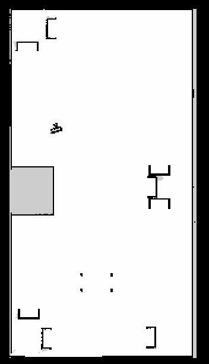

    <h1>Task 1C - Instructions</h1>

---

> **Note:** Before attempting the task make sure you have gone through the [Learning resources - Autonomous Navigation ](../../learning_resources/navigation/navigation.md).

> ## Important Note: Pull the latest repo of `eYRC-2023_Cosmo_Logistic` and do the **`colcon build`** for this task

---

## Task:

For this you have to write a **single** Python script **`ebot_nav_cmd.py`** to navigate the eBot through the `Pose` (x,y) and `Orientation` (yaw) i.e. `[x, y, yaw]` in the order of 

- **P1 :** &nbsp; [1.8, 1.5, 1.57]
- **P2 :** &nbsp; [2.0, -7.0, -1.57]
- **P3 :** &nbsp; [-3.0, 2.5, 1.57]

The allowed tolerance:
- **`Pose` :  +-0.3 m**
- **`Orientation` :  +-10 degrees**

## Process

In order to complete this task you will first have to **map the warehouse**. You will find resources to help you through this task in the *Mapping* subsection of *ROS2 Navigation* in *Learning Resources* Section of this mdbook.

Once you have created the map, you can try **navigating in the map using rviz**. A Guide to navigation using **ROS2** is provided in the *Navigation* subsection of *ROS2 Navigation* in *Learning Resources* Section of this mdbook. 

Here you have to build the map using `slam_toolbox`, that you need to submit with other requirement in this task.

It should look something like `map_name.pgm` this one below,

And now you may proceed with scripting the Python script **`nav2_cmd.py`** to navigate the eBot.

> **Hint:** 
> - You can refer [Simple Commander API](https://navigation.ros.org/commander_api/index.html#) by Nav2 to make the script for eBot.

You may watch the expected output video recording to clear out any confusion. 

---

### Expected Output

Here as we are just providing the `[x,y,yaw]` to the nav2 stack, your output will be as per your tuning of Nav2 parameters in `nav2_param.yaml`.

(*So, to get excellent result and marks tune your parameters ;p*)

<!-- <video width="800" height="400" controls> 
  <source src="task_nav.mp4" type="video/mp4">
</video> -->

<iframe width="700" height="400"
    src="https://www.youtube.com/embed/GeNK2emA4Uo?si=9zwtflLmRPVviGuk">
</iframe> 

---

> **Optional Task:** 
> * Make it move from P3 -> P4, where P4: [-1.0, -5.0, 1.57], Hint: Tuning is required
> * Make it move from P3 -> P5, where P5: [-1.0, -8.0, 1.57], Hint: How to mark a Avoiding Zone in map?  [Refer here](https://navigation.ros.org/tutorials/docs/navigation2_with_keepout_filter.html)

---

> **Note:** Deadline for the submission of this task is **16th October, 2023**