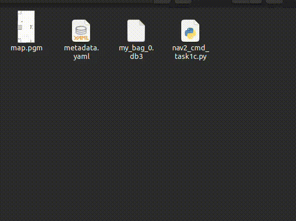

<style>
.back{
	position: fixed;
	width: 250px;
	height: 250px;
	top: 50%;
	left: 50%;
    margin-top: auto; 
    margin-left: auto; 
	opacity: 0.15;
    z-index: -1;
	}
</style>
<!--  -->

<center>
    <h1>Task 1C - Submission</h1>
</center>

---

## Submission instructions for task 1C:

> * ***NOTE:** All your tasks will be checked using a plagiarism software. If any submitted file is found to be plagiarised, e-Yantra reserves the right to disqualify the team.*

1. Upgrade your `eyantra-autoeval` package by running the command given below

    ```sh
    pip3 install -U eyantra-autoeval
    ```

2. First launch the robot in gazebo as instructed before `ros2 launch ebot_description ebot_gazebo_launch.py` 

3. Now launch the bringup launch for Nav2 stack `ros2 launch ebot_nav2 ebot_bringup_launch.py` keep it running.

4. Then open a new terminal and execute the auto eval script `eyantra-autoeval evaluate --year 2023 --theme CL --task 1C`.

5. Wait for `DATA COLLECTION STARTED FOR TASK 1C` INFO to be shown on the terminal.

6. Now, run your Python script to navigate the bot, and once the task is completed go to the autoeval terminal and use `Ctrl + c` key **once** which will generate a `my_bag/my_bag_0.db3` bag file in the same directory *(inside a folder named `my_bag`)*.

> **NOTE:**  You can verify the **bag file** duration by using the command `ros2 bag info my_bag_0.db3` by navigating to the directory containing `.db3` bag file. This is not the run time of your task but the bag file recording time.

7. Now add your python script and rename it as `nav2_cmd_task1c.py` to the same directory and also add your `map.pgm` *(It will be something you named while saving)*

8. Create a `.zip` file by selecting all three files **i.e. Python, yaml, pgm and bag file**. Take a look at the below `.GIF` to understand it better. (Note: Do not compress the whole folder)



9. Once the zip is created, rename it as `<CL#team_id_1C>` *(For example, if your team id is 1679, rename file as `CL#1679_1C.zip`)* and submit on **eYRC Portal - Task 1** by selecting option 1C.

### Grading 

> **This task will be graded out of 30**
>  
>   `Maximum Marks` - `Marks: 30.00` <br>
>   `Failed Task` - `Marks: 0.00`

### Formula

> Task_1C_Marks = ([CNP1 + CNP2 + CNP3] * 7) + (MPS * 9) 


**CNP: Correct Navigation Pose** - 
- The navigation pose correspondes to the three given poses which is marked on the map in `Instrctions Section`
- The value for CNP1, CNP2 and CNP3 will be in binary format and corresponds to respective mark on the warehouse arena.
- Allowed deviation from actual given pose: **+-0.3 meter (pose error) and +-10 degrees(orientation error)**
- For example: if the bot reached P1 and P2 within error, and failed to reach P3 (either distance or orientation), the score will be CNP1=1, CNP2=1 and CNP3=0

**MPS: Map Score** - 

- Maximum map score: 9
- It will be scored based on how well the map is constructed using SLAM
- The map should be closed, continues and non-distored.
- It will be scored using matching algorithms