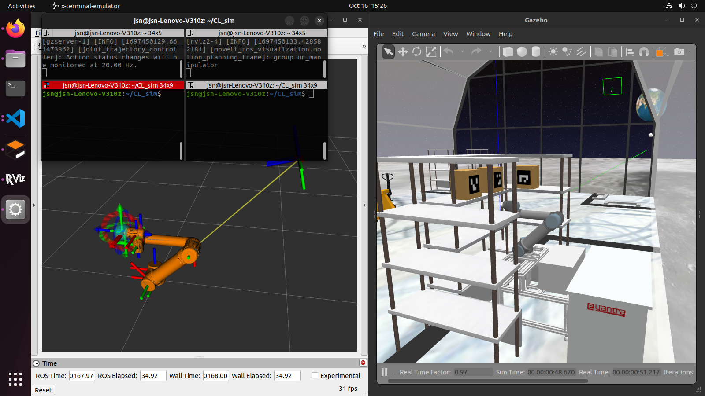

<style>
.back{
	position: fixed;
	width: 250px;
	height: 250px;
	top: 50%;
	left: 50%;
    margin-top: auto; 
    margin-left: auto; 
	opacity: 0.15;
    z-index: -1;
	}
</style>

<center>
    <h1>Task 2A - Submission</h1>
</center>

---
## Submission instructions for task 2A: 
(Both video and zip file are compulsory for task 2A.)

> - ***NOTE:** All your tasks will be checked using a plagiarism software. If any submitted file is found to be plagiarised, e-Yantra reserves the right to disqualify the team.*


### 1. ZIP FILE

1. Upgrade your `eyantra-autoeval` package by running the command given below

    ```sh
    pip3 install -U eyantra-autoeval
    ```

2. First launch the robot in gazebo as instructed before `ros2 launch ur_description ur5_gazebo_launch.py` and `ros2 launch ur5_moveit spawn_ur5_launch_moveit.launch.py` keep it running *(Replace the package name of `ur5_moveit` if you have named it differently)* .

3. Then open a new terminal and execute the auto eval script `eyantra-autoeval evaluate --year 2023 --theme CL --task 2A`.

4. Wait for `DATA COLLECTION STARTED` INFO to be shown on the terminal.

5. Now, run your Python script to manipulate arm, and once the task is completed go to the autoeval terminal and use `Ctrl + c` key **once** which will generate a `my_bag/my_bag_0.db3` bag file in the same directory *(inside a folder named `my_bag`)*.

> **NOTE:**  You can verify the **bag file** duration by using the command `ros2 bag info my_bag_0.db3` by navigating to the directory containing `.db3` bag file. This is not the run time of your task but the bag file recording time.

*(You can add multiple python file, but remember to number it accordingly as given in the below naming convention **Example:** 1task2a.py, 2task2a.py, ...)*

6. Now add your python scripts and rename it as `<number your multiple file>task2a.py` to the same directory and create a `.zip` file by selecting all three files **i.e. Python, yaml and bag file**.


### 2. Video Submission
- You are suppose to submit a youtube video of your Task 2A execution, a simple screen recording in below given window setup. *[compulsory]*



- Create a setup **as same as** shown above (make sure all the scripts (inc. the evaluator) are visble within the terminal) and submit it under the section **video upload**.


### Grading 

> **This task will be graded out of 50**
>  
>   `Maximum Marks` - `Marks: 50.00` <br>
>   `Failed Task` - `Marks: 0.00`

### Formula

> Task_2A_Marks = ([CPD1 + CPD2 + CPD3] * 15) + (Bonus) 

- **CPD:** Correct Pick and Drop (binary value) for each box placed on the table.
- **Bonus:** If you pick and drop all the three boxes, the bonus of 5 marks will be added.

---
> **Note:** Deadline for the submission of this task is **10th November, 2023**