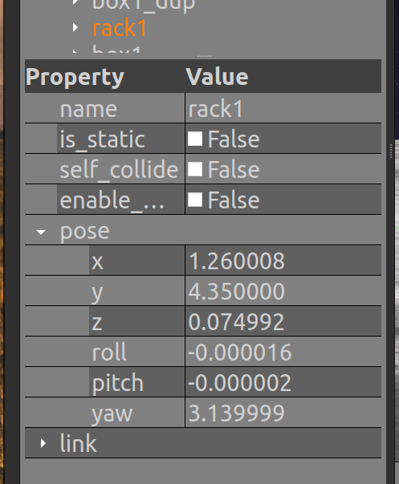

<style>
.back{
    position: fixed;
    width: 250px;
    height: 250px;
    top: 50%;
    left: 50%;
    margin-top: auto; 
    margin-left: auto; 
    opacity: 0.15;
    z-index: -1;
    }
</style>

<center>
    <h1>Task 2B - Instructions</h1>
</center>

---

> **Note:** Before attempting the task make sure you have gone through,
> 1) [Learning resources - Autonomous Navigation ](../../../Task_1/learning_resources/navigation/navigation.md)
> 2) [Docking](../task2b/learn_docking.md)
> 3) [Attaching Rack](../task2b/learn_attaching.md)

---

## Task:


For this, you have to,

1) Write a Python script **`ebot_docking_service.py`** for docking the eBot with the rack using the ultrasonic sensors and P-controller logic.

2) Write another python script **`ebot_nav2_cmd.py`** that will 
    * Navigate the ebot using Nav2
    * Trigger the docking service that will dock the ebot
    * Attach/Detach the **rack** with the ebot using Attach/Detach service

* On the Arena you have 2 racks with the box, and for this task, you are supposed to 
    - a) Go to the **`rack 1`**
    - b) Dock the **`rack 1`** using the docking service
    - c) Attach the **`rack 1`** 
    - d) Go to **arm pose 1 (AP1)** and Detach **`rack 1`** 
    - e) Return to home pose

Refer below figure to clear things out,


Here,
- **AP1 :** &nbsp; `[0.5, -2.455, 3.14]`

- Rack pose can be determined from the Gazebo. Right panel, under `Models >> rack1` and in the `Property >> pose`. **RACK1 :** &nbsp; `[1.26, 4.35, 3.14]`

<div style="text-align:center"></div>

* The allowed tolerances:
    - **`Pose` :  +-0.3 m**
    - **`Orientation` :  +-10 degrees**

## Process

To complete this task you will first have to **map the warehouse** again. You will find resources to help you through this task in the *Mapping* subsection of *ROS2 Navigation* in *Learning Resources* Section of this mdbook.

Once you have created the map, you can now continue with making the `ebot_docking_service.py` for which you can refer to `ebot_docking/scripts/ebot_docking_boilerplate.py`, this will be the docking service server to dock the eBot with the rack.

>**Important:** Once you are done building the script in a pkg you also have to update the `CMakeList.txt` of that pkg, like this below one
>```
>   install(PROGRAMS
>       scripts/ebot_docking_boilerplate.py    <---Add the script like this
>   DESTINATION lib/${PROJECT_NAME}
>   )
>```
> and do the **`colcon build`** again

Finally, Build the `ebot_nav2_cmd.py` to do the whole pick and place of the **`rack 1`**.


> **Hint:** 
> - You can refer [Simple Commander API](https://navigation.ros.org/commander_api/index.html#) by Nav2 to make the script for eBot.
> - To know about P-Controller [refer to this](https://www.youtube.com/watch?v=DUNdvuuZDc0)
> - For tuning of navigation you might need to tune `controller_server` and `velocity_smoother` for proper linear and angular motion.


You may watch the expected output video recording to clear out any confusion. 

---

### Expected Output


(*So, to get excellent results and marks tune your parameters, again! ;p*)

<!-- <video width="800" height="400" controls> 
  <source src="task_nav.mp4" type="video/mp4">
</video> -->

<iframe width="700" height="400"
    src="https://www.youtube.com/embed/zPq0fVGtY4w?si=pO4jdbxabyQe85r2">
</iframe> 

---

> **Optional Task:** 
>
> * **TASK A** : Since the bot is planning with the current ebot base size defined in nav2_params.yaml under local cost_map - footprint and under global cost_map - robot_radius. When the ebot is attached to the rack, the planner will still plan as per the same dimensions, Think of something more robust way. So that ebot can plan robustly.
>
> * **TASK B** : Also you can see once the rack is picked by the bot, the map does have the rack footprint on the map, what can we do about that ??
>
> **Hints will be given in the TASK 2B Live Session Video, do attend!!** 

---

> **Note:** Deadline for the submission of this task is **10th November, 2023**