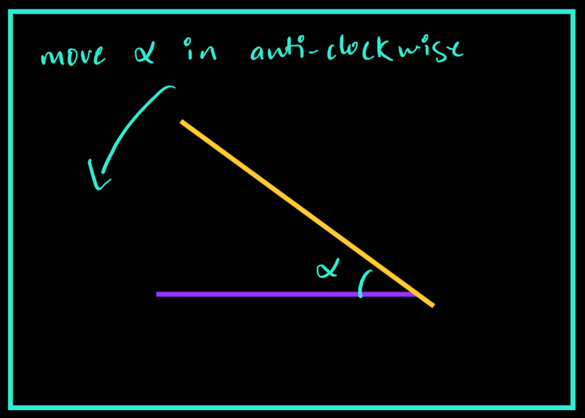

# Docking 
---

## Ultrasonic Sensors on the bot

On the rear side of the bot, you can find 2 ultrasonic sensors. Here is the representation of it.

<div style="text-align:center"></div>

The ros2 topic for this sensors are `/ultrasonic_rl/scan` for **left** and 
`/ultrasonic_rr/scan` for **right**, using msg type `sensor_msgs/msg/Range`

> - To enable or disable the visualization of the sensors you can go to `ebot_description/models/ebot/ebot.gazebo`
> - Under ebot.gazebo, go to the Ultrasonic section
> ```   
>    <!-- Ultrasonic -->
>    <xacro:macro name="ultrasonic_sensor" params="name">
>    <gazebo reference="${name}">
>    <sensor type="ray" name="${name}">
>    <pose>0 0 0 0 0 0</pose>
>    <visualize>true</visualize> ```

---

## Concept

Consider a scenario like below,

<div style="text-align:center"></div>

here you can see we can first align the orientation of the bot wrt the rack,

- Aligning orientation: We can do this using the `IMU` sensor directly or using `Ultrasonic` sensors reading and doing simple coordinate geometry.

    1) Using IMU directly, the orientation data of the ebot can be directly accessed using topic `/imu` and msg-type `sensor_msgs/msg/Imu`

    > Doing `ros2 topic echo /imu --once`
    > ```
    >    header:
    >  stamp:
    >    sec: 823
    >    nanosec: 847000000
    >  frame_id: ebot_base_link
    >orientation:
    >  x: 0.000953526911620944
    >  y: 0.00021382570450593477
    >  z: -0.00048188256696325623
    >  w: 0.9999994064269182
    >  ```
    >
    > Angles are in `quaternion`, GOOGLE it !!!


    Here you can see, that we get the orientation of the ebot and we already know the orientation of the rack. Taking the difference will give us angular distance.

    <div style="text-align:center"></div>

    2) Using `Ultrasonic` sensors reading, on topic `/ultrasonic_rl/scan` for **left** and 
`/ultrasonic_rr/scan` for **right**

    > Doing `ros2 topic echo /ultrasonic_rl/scan --once`
    > ```
    >    header:
    >stamp:
    >    sec: 1369
    >    nanosec: 404000000
    >frame_id: ebot_base_link
    >radiation_type: 0
    >field_of_view: 0.26179999113082886
    >min_range: 0.029999999329447746
    >max_range: 4.099999904632568
    >range: 1.163640022277832   <<<--- Here is the range we need!
    >```

    Using the readings from both sensors, you can find the equation of Line A and you already know the equation of Line B

    <div style="text-align:center"></div>

- Aligning Distance: We can do this using the `Ultrasonic` sensors reading to find the rear distance and keep moving back, Easy PIsy !!
---

## Steps 

1) We have provided a sample custom service msg pkg under `ebot_docking/srv/DockSw`, either you can use it or else you can make your custom service msg pkg for this.
    ```
    ### Request
    bool linear_dock          >> Linear Correction
    bool orientation_dock     >> Angular Correction
    float64 distance          >> Optional param for distance
    float64 orientation       >> Goal Orientation 
    string rack_no            >> Rack number
    ---
    ### Response
    bool success   # indicates successful run of triggered service
    string message # informational, e.g. for error messages 
    ```
2) Make a Docking service using the above pkg, which will be docking the bot using the above methods

3) A boilerplate is been provided in the latest repo, under `ebot_docking/scripts/ebot_docking_boilerplate.py`

4) In the boilerplate, you have to write the **controller logic** for docking. Here, for example, the P-Controller is feasible and easy. What is P-Controller, go explore the internet for this and learn.

5) To write ros2 service server and client refer [here](https://docs.ros.org/en/humble/Tutorials/Beginner-Client-Libraries/Writing-A-Simple-Py-Service-And-Client.html).
---

### Here is the example video of docking using the custom service type `ebot_docking/srv/DockSw`,

<iframe width="700" height="400"
    src="https://www.youtube.com/embed/t7rnnU28tMo?si=eA9BcKGqTq0f9TYR">
</iframe> 