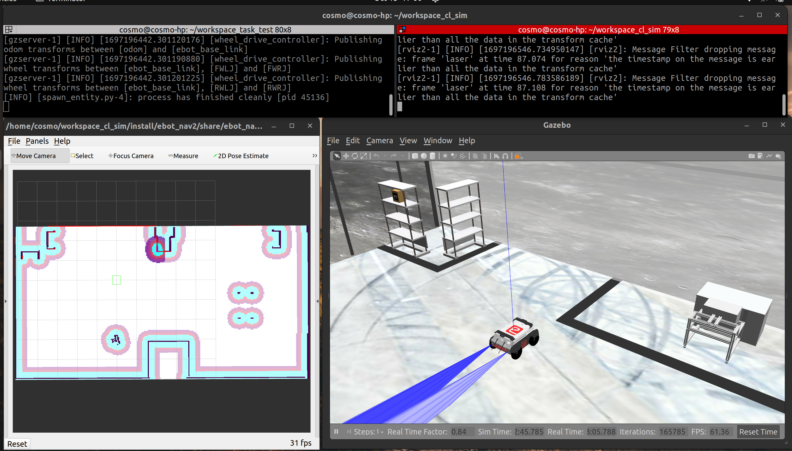
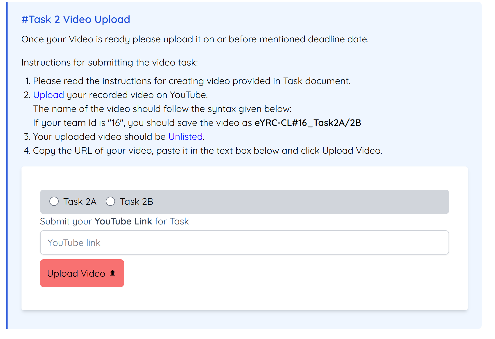

<style>
.back{
    position: fixed;
    width: 250px;
    height: 250px;
    top: 50%;
    left: 50%;
    margin-top: auto; 
    margin-left: auto; 
    opacity: 0.15;
    z-index: -1;
    }
</style>
<!--  -->

<center>
    <h1>Task 2B - Submission</h1>
</center>

---

## Submission instructions for task 2B:

> * ***NOTE:** All your tasks will be checked using plagiarism software. If any submitted file is found to be plagiarised, e-Yantra reserves the right to disqualify the team.*

1. Upgrade your `eyantra-autoeval` package by running the command given below

    ```sh
    pip3 install -U eyantra-autoeval
    ```

2. First launch the robot in the gazebo as instructed before `ros2 launch ebot_description ebot_gazebo_launch.py` 

3. Now launch the bringup launch for Nav2 stack `ros2 launch ebot_nav2 ebot_bringup_launch.py` keep it running.

4. Then open a new terminal and execute the auto eval script `eyantra-autoeval evaluate --year 2023 --theme CL --task 2B`.

5. Wait for the `DATA COLLECTION STARTED FOR TASK 2B` INFO to be shown on the terminal.

6. Start your `ebot_docking_service.py` to start the docking service server.

7. Now, run your Python script to do the dock and place of the rack, and once the task is completed go to the autoeval terminal and use the `Ctrl + c` key **once** which will generate a `my_bag/my_bag_0.db3` bag file in the same directory *(inside a folder named `my_bag`)*.

> **NOTE:**  You can verify the **bag file** duration by using the command `ros2 bag info my_bag_0.db3` by navigating to the directory containing `.db3` bag file. This is not the run time of your task but the bag file recording time.

8. Now add your Python scripts and rename them as `ebot_nav2_cmd_task2b.py` and `ebot_docking_service_task2b.py` to the same directory and also add your `map.pgm` *(It will be something you named while saving)*

9. Create a `.zip` file by selecting all five files **i.e. 2 pythons, yaml, pgm, and bag file**.


10. Make sure the dir/zip should contain,
    - `ebot_nav2_cmd_task2b.py`
    - `ebot_docking_service_task2b.py`
    - `metadata.yaml`
    - `my_bag_0.db3`
    - `map.pgm`

11. Once the zip is created, rename it as `<CL#team_id_2B>` *(For example, if your team id is 1679, rename the file as `CL#1679_2B.zip`)* and submit on **eYRC Portal - Task 2** by selecting option 2B.

### Video Submission 

Here you are also supposed to submit a YouTube video of your Task 2B execution, a simple screen recording in below given window setup.



and submit it under the section **Video Upload**




### Grading 

> **This task will be graded out of 50**
>  
>   `Maximum Marks` - `Marks: 50.00` <br>
>   `Failed Task` - `Marks: 0.00`

### Formula

> **Task_2B_Marks =  [(200-T) * 0.075] + (RPN * 18) + (RD * 6) + (APN * 14)  + (RP * 3)**
 
 **T: Time for execution** - 
- Maximum Time: 200 sec (or 3.3 mins)
- T = End time - Start time
- Start time: First movement of ebot from its **initial position** after the start of eyantra-autoeval.
- End time: Time of reaching to the `HOME` pose.
- Conditions:
    - if T < 80:  T = 80
    - if T > 200: T = 200

**RPN: Rack Pose Navigated** - 
- The rack pose eBot navigated, this pose is the center of the rack below.
- Value of RPN is integer.
- A navigation (RPN) is consider only if it navigates with the above tolerance given (i.e. **+-0.3 meter (pose error) and +-10 degrees(orientation error)**) to the respective rack pose.

**RD: Rack Dock** - 
- No. of rack eBot dock as per the below conditions:
    - eBot should reach the rack pose.
    - Rack should move with the eBot from the rack pose.

**APN: Arm Pose Navigated** - 
- The arm pose eBot navigated, this poses are AP1, AP2 and AP3. Refer image for this.
- Value of APN is integer.
- A navigation (APN) is consider only if it navigates with the above tolerance given (i.e. **+-0.3 meter (pose error) and +-10 degrees(orientation error)**) to the respective arm pose.

**RP: Rack Placed** - 
- No. of rack eBot placed as per the below conditions:
    - eBot should reach the Arm pose.
    - Rack should be placed at Arm Pose and eBot should left the position.