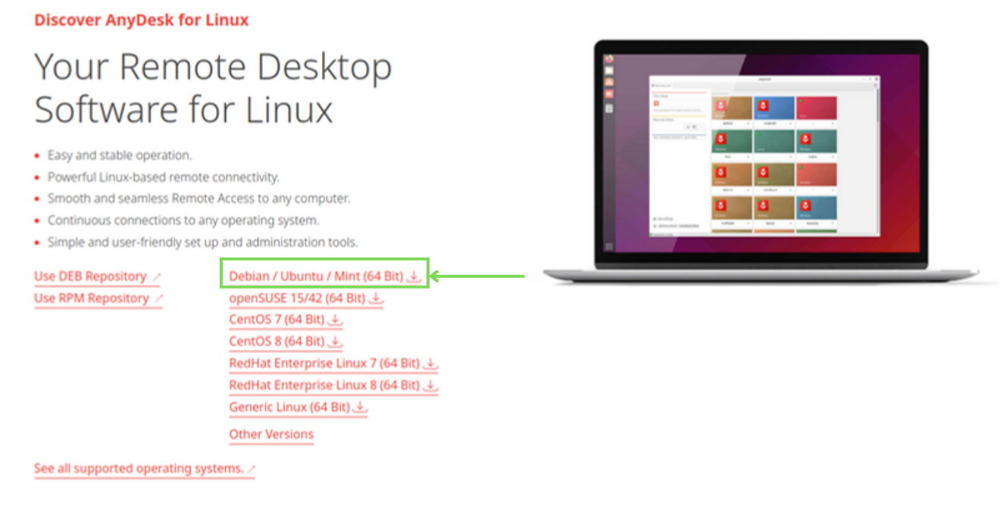
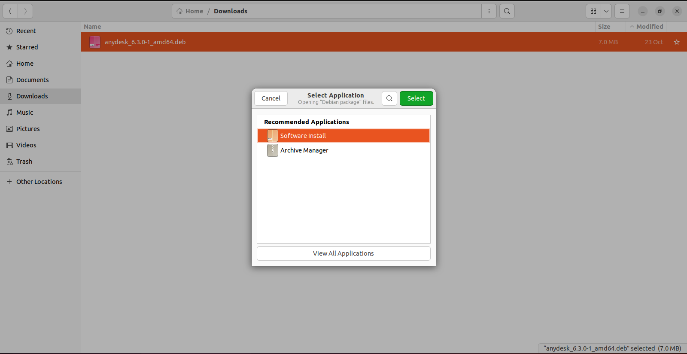
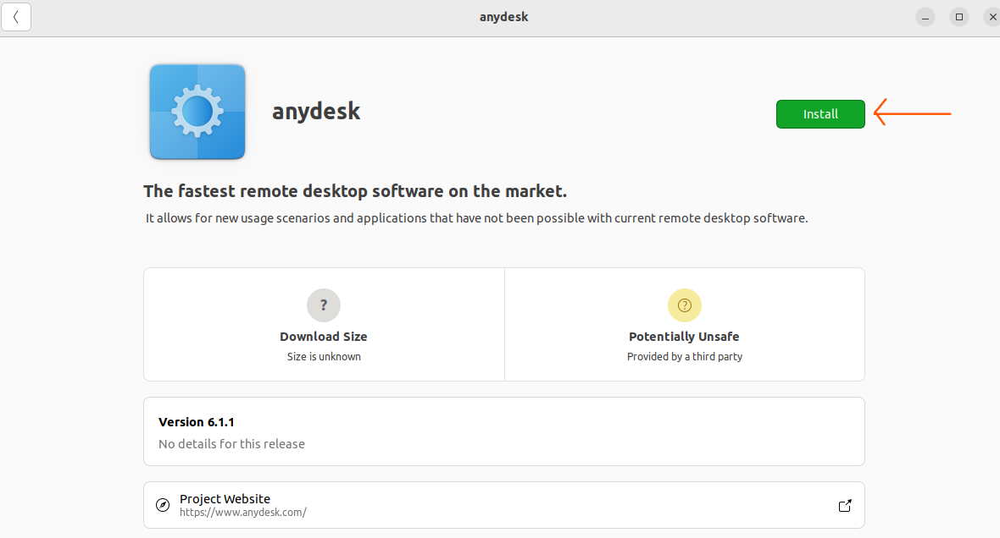
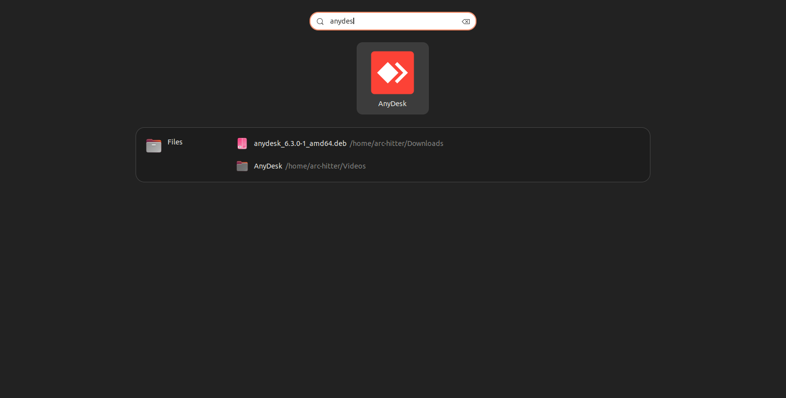
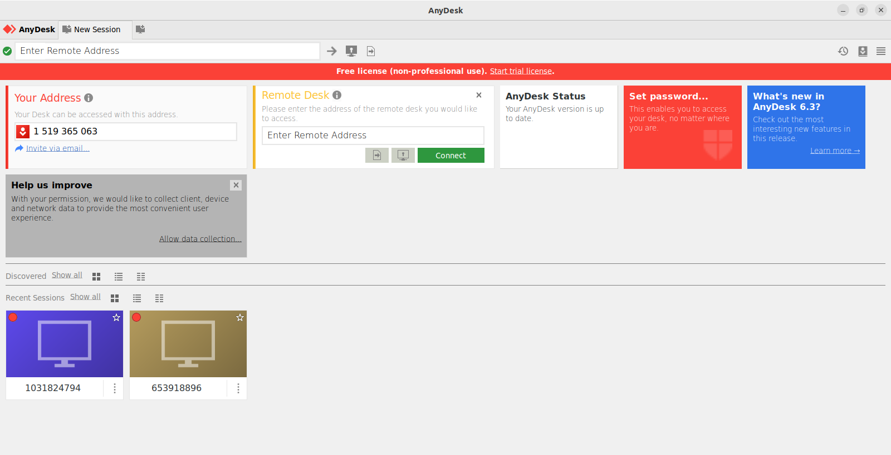

## Install Anydesk on ubuntu:

### 1. Using GUI Method-

> STEP 1 - Open the official website of `AnyDesk` using the following link on any browser (Chrome for example).
> 
> [Anydesk Website Link](https://anydesk.com/en/downloads/linux) - https://anydesk.com/en/downloads/linux

> STEP 2 - Scroll down a little and you will see a `Debian / Ubuntu / Mint (64 Bit)` link as highlighted in the image below. Click on the link to download the installation file.
>
>  
> <p></p>

> STEP 3 - Once the file is downloaded, right-click on the file and select `Open With Other Application` and choose `Software Install`
>
> For some who do not find `Software Install` in select application by default, then go to `View All Applications` and there you can view the option for `Software Install`
>
>  
> <p></p>

> STEP 4 - Now you will see a pop-up window as shown below where you need to press `Install` to get started with anydesk installation.
>
>  
> <p></p>

> STEP 5 - Checking your installation: Open start menu by searching for `anydesk` and click on this icon as shown in the image below.
>
>  
>
> Now you can use this software to get access to remote pc at our end to operate ebot.
>
>  
> <p></p>

### 2. Using Terminal Method-

> STEP 1 & STEP 2 - Follow the same steps as above for gui method to download the installation (debian) file.

> STEP 3 - First update and upgrade your system using following commands
>
> ```sh
> sudo apt update
> sudo apt upgrade
> ```

> STEP 4 - Move to the respective directory where the file is downloaded in the terminal and install using `dpkg`
>
> (Enter your password whenever asked)
> ```sh
>
> # moving to directory where `anydesk_6.3.0-1_amd64.deb` file is present. 
> # Select your location accordingly
> cd ~/Downloads/
>
> # install dpkg (debian package) installer
> sudo apt install dpkg
>
> # install anydesk software using debian file
> sudo dpkg -i anydesk_6.3.0-1_amd64.deb
>
> ```

> STEP 5 - Follow steps similar to gui method to verify installation.


### Anydesk Interface:
<video width="800" height="400" controls> 
  <source src="anydesk_interface.mp4" type="video/mp4">
</video>

### Resources:

- [How to install Anydesk in a Linux System](https://www.youtube.com/watch?v=fqOPukxJ8oE)

---