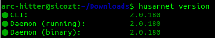

## Installing Husarnet on Linux:

> You can refer the official [Husarnet Linux installation Guide](https://husarnet.com/docs/platform-linux-install) or follow instructions given below specific for Ubuntu 22

- To install `Husarnet`, paste the following lines into your terminal:
    ```sh
    # update, upgrade and check if `curl` is installed
    sudo apt update && sudo apt install -y curl

    # install husarnet using curl
    curl -s https://install.husarnet.com/install.sh | sudo bash
    ```

- You can verify the installation by typing `husarnet version` in the terminal
    
     

- Refer this to troubleshoot your problems - [Troubleshooting Husarnet on Linux](https://husarnet.com/docs/troubleshooting-linux/)


### Using Husarnet and ROS 2:

#### 1. Configuration of DDS:

- The default *ROS Middleware Abstraction Interface (RMW)* implementation for *ROS 2 humble* is `Fast DDS`

- You can read more about RMW here -> [ROS 2 - RMW](https://docs.ros.org/en/humble/How-To-Guides/Working-with-multiple-RMW-implementations.html)

- So, we need to configure DDS implementations on our systems on which ROS 2 is running.

- First, install Husarnet-DDS on each device with which your team will be joining for practice slots from GitHub releases available for Linux: (You may refer this official guide -> [Husarnet Tutorial ROS 2](https://husarnet.com/docs/tutorial-ros2))

    ```sh
    RELEASE="v1.3.5"
    ARCH="amd64"

    sudo curl -L https://github.com/husarnet/husarnet-dds/releases/download/$RELEASE/husarnet-dds-linux-$ARCH -o /usr/local/bin/husarnet-dds
    sudo chmod +x /usr/local/bin/husarnet-dds
    ```

#### 2. Select DDS Implementation:

- Next, choose the DDS implementation that you want to use with your ROS 2 application. Here, it is Fast DDS and is supported by Husarnet-DDS.

- Set up the required environment variables based on the above chosen DDS implementation on each device.

    ```sh
    export RMW_IMPLEMENTATION=rmw_fastrtps_cpp
    export FASTRTPS_DEFAULT_PROFILES_FILE=/var/tmp/husarnet-fastdds-simple.xml
    husarnet-dds singleshot
    ```

- ***NOTE:*** If you want each terminal to connect to husarnet network, then add it in your bashrc similarly as we did for ros 2 setup source file and then source bashrc file.

    ```sh
    echo "export RMW_IMPLEMENTATION=rmw_fastrtps_cpp" >> ~/.bashrc
    echo "export FASTRTPS_DEFAULT_PROFILES_FILE=/var/tmp/husarnet-fastdds-simple.xml" >> ~/.bashrc
    echo "export ROS_DOMAIN_ID=2" >> ~/.bashrc
    . ~/.bashrc     # soruce bashrc file
    ```

#### 3. Join husarnet group:

- Use this command to join a husarnet group:

    ```sh
    husarnet join <your-join-code> <device-hostname>
    ```

- **Set your *<device_hostname>* as your team id when you join. Ex: cl_1967**

- Each team will be be given the joining code in your particular slot after you join.

### Troubleshooting

- After successfull installation of husarnet and joining the husarnet group, even if you are not able to listen topics via `ros2 topic list` then try restarting ros daemon:
    ```sh
    ros2 daemon stop
    ros2 daemon start
    ```

---