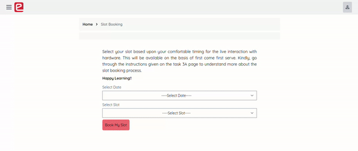
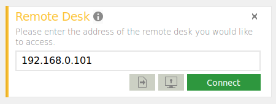

    <h1>Task 3A - Remote Setup for Hardware</h1>

---

> Take a backup of your colcon (project) workspace if your team is not comfortable with git usage and its commands.

## General Instructions:
- Our team has setup hardware to which you will get access remotely.
- There are some guidelines to be followed in order to book a slot for your team to get access to remote hardware and complete the task.
- Once your team selects a slot, your team will get access to hardware remotely via husarnet and anydesk software which you need to install in your system prior to your alloted slot.

## Install softwares

1. [Anydesk Software](anydesk/anydesk_installation.md)

2. [Husarnet](husarnet/husarnet_installation.md)

## Pre-requisite:

Make sure your team have at least 2 computers/laptops connected to the internet. These are required for-

1. Working with ROS 2 using Anydesk to operate and debug robots.

2. To view the camera feed of e-Yantra’s warehouse. (It is not necessary but recommended to have this second PC for meeting and viewing camera feed.)

3. You can also use husarnet as debugging device (You'll get access to ros topics, services, actions, etc. as Command Line Interface (CLI) )

***You can use [Ping Test](https://www.meter.net/ping-test/) to check your ping. It is *highly recommended* that the ping should be *less than 50ms* (try to use any LAN connection if possible).***

> **TIP:** You can start working on improving your algorithm and test in simulation beforehand such that you can directly start executing code when you get hardware access and focus more time on real life hardware problems rather debugging programmatical issues.

## Slot Selection:

- Every team will have equal number of slots for `ebot` and `arm`.

- The team can select slots for individual tasks (ebot and arm) on the portal, and will be announced on discuss forum once it is live.

- **Theme developers will be present throughout the duration of the slot to assist teams in connecting to the hardware.**

- The slot selection will be based on a first-come-first-serve basis.

- Once the team has selected the slot on portal, e-Yantra Team will update and confirm the slots through a shared spreadsheet.

- In case of any delays/cancellations/updates/technical-issues, make sure to check the spreadsheet. To check the latest updates 
before joining for your selected slot. 

- Make sure all the team members are available during the selected slot. ONLY the team leader should fill out the form on portal after confirming with all the members.

- A meeting link shall be added next to your slot for ease of communication.

- Teams have to refer the same portal for booking other upcoming slots. So, get familiar to the interface at the very beginning.

In summary-

- Use [e-Yantra Portal](https://portal.e-yantra.org) for selecting slots. Look for the gif below to get an overview of slot booking interface.

    

- Use the Spreadsheet for:

    - Verifying if your team has been assigned your preferred slot

    - Check for any delays or cancellations

    - Finding the google meet link for your slot

## Remote Connection with the hardware

> **Note:** ***`Anydesk`*** and ***`Husarnet`*** setup should be completed before joining the selected slot.

Follow the [Anydesk](anydesk/anydesk_installation.md) and [Husarnet](husarnet/husarnet_installation.md) documents to setup your laptops.

### A. Anydesk:

- It will be used to give participating team a direct access to system connected with `ebot` and `ur5 arm`.

- One will have remote desktop accessibility via Anydesk.

- Team will be provided with the IP address to connect to remote PC here (at e-Yantra) during their given slot in the meeting chat section.

- Enter the address of the remote desktop and press `Connect` to get access. (Refer image sample below)

    

#### Instructions to follow:

1. Team has to make sure that they are restricted to work in a defined folder that will be instructed during the meeting.

2. ***Your screen will be constantly monitored and failing to follow these rules and peeping into system settings/applications/files/folders will strictly result into disqualification from the competition***.

3. Team needs to check thier internet connection. Highly recommended to have a stable LAN connection or wifi access. Avoid using mobile hotspots. (Test your ping before joining the slot).

4. ***Every team will be alloted a folder and have to clone their own repo code into the remote PC and build the workspace.***

5. Keep your login details ready such as `github id` and `access token` so that the team can clone repo quickly.

6. We highly recommend that you all get familiar/practice with git and building ros workspace beforehand. (Ideally you all should have enough command on git till now).

7. No extra time will be provided for repo/code setup. You have to manage everything within the time slot provided. Hence, follow point 7 sincerly.

### B. Husarnet:

- After joining the online meeting (provided in the Spreadsheet mentioned above), your team will be given a `husarnet joining code`. 
- Follow the instructions as provided in [husarnet installation](husarnet/husarnet_installation.md) guide to connect ROS 2 with the remote device.
- Now you can use your own system to debug during your slots using `ros topics/messages/services/actions/logs`

> **Note:** Since, the theme requires realtime data and to avoid latency, we are providing access to anydesk for seamless experience. You'll get access to husarnet to use ros 2 over CLI. So, you may use husarnet as a debugging tool while the code is running on remote desktop.

---

***Get ready for hands-on experience with industry standard hardware robots!***

---