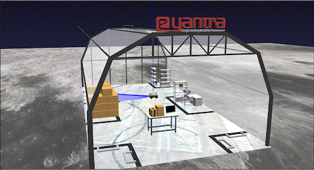

<!-- <center></center> -->

<style>
.back{
	position: fixed;
	width: 250px;
	height: 250px;
	top: 50%;
	left: 50%;
    margin-top: auto; 
    margin-left: auto; 
	opacity: 0.15;
    z-index: -1;
	}
</style>
<!--  -->

<center>
    <h1>Welcome to Task 4C</h1>
</center>

---

</br>


### 4C **Dock, Pick and Place multiple boxes**
*Dock the rack using ebot towards robot arm and pick and place in dropbox*

> **NOTE:** Make sure you have pulled the latest repo as per the instructions given on [page](/src/Task_4/task_4.md).

#### Task

- Start your world using `ros2 launch eyantra_warehouse task4c.launch.py` command. To spawn your arm, start the launch file you created during the `moveit_setup_assistant` part, similar to task 2A.

    > (If all done correctly, you should see a world spawned with arm and eBot with three racks in total).
    >
    > 

- Navigate to the specified rack having the package mentioned in the configuration file as `package_id`. You can use the `yaml` python module to read the values.
<a href="./config.yaml"  target="blank"><button type="button">Download</button></a>

(If the above link doesn't work, try to copy the content given below to a file named `config.yaml`, which should be created by you)

```yaml
position:
    - rack1: [1.26, 4.34, 3.14]
    - rack2: [2.03, 3.30, -1.57]
    - rack3: [1.61, -1.75, 1.57]

package_id: [3, 1, 2]
```

- Dock and bring the rack in front of the arm.

- Find the TF of the aruco marker, and finally do manipulation of the robotic arm.

- The arm should be able to pick the box from the rack and place it on the drop position (i.e. table kept behind the arm).

### Explicit Rules for task 4C:

- Once you start the task, no starting or stopping of any scripts are allowed during the run.
- The initial position of the arm should be the same as the one in task 1 (or the one which is by-default).

#### Formula:

> **Total_marks** = (900-T) * 0.4 + ACI * 10 + ACP * 50 + ACD * 50 + ECN * 50 + ECP * 20 + ECD * 50 - P * 25

The abbreviation details are as follows:
- **T:** Total time taken for the run. If it is found to be greater than 900 seconds, then the marks for the time will be made to zero.
- **ACI:** Arm Correct Identification, parameter is increased when the TF is correctly published pointing to the Aruco marker’s centre position. The maximum value of this parameter is 3.
- **ACP:** Arm Correct Position, parameter increases when the package is picked up using the magnetic gripper on the arm. The maximum value of this parameter is 3. 
- **ACD:** Arm Correct Drop, parameter increases when the package is dropped on the table kept behind the arm. The maximum value of this parameter is 3. 
- **ECN:** eBot Correct Navigation, parameter increases when the eBot is within the desired perimeter of the rack. Repeated attempts to enter into the area of the same rack will not yield to any additional marks. The maximum value of this parameter is 2.
- **ECP:** eBot Correct Pick, parameter increases when the eBot has correctly docked and attached the rack with the eBot using magnet. The maximum value of this parameter is 2.
- **ECD:** eBot Correct Drop, parameter increases when the eBot has correctly dropped the rack in front of the arm. The maximum value of this parameter is 2. 
- **P:** Penalty, parameter increases whenever the eBot or the arm is in collision state.


Finally, this task marks will be converted to a mark out of 30. The grading will be relative therefore the highest scored team will be having 30 marks.

> NOTE: This task will be manually graded and therefore all the marks will be updated after the deadline.
<p></p>

</br>

---
