<!-- <center></center> -->

<style>
.back{
	position: fixed;
	width: 250px;
	height: 250px;
	top: 50%;
	left: 50%;
    margin-top: auto; 
    margin-left: auto; 
	opacity: 0.15;
    z-index: -1;
	}
</style>
<!--  -->

<center>
    <h1>Theme Rulebook - Cosmo Logistics: eYRC 23-24</h1>
</center>

---

</br>

> **Index**
> 
> **1: Introduction**
> 
> **2: Theme & Arena Description**
>
> 2.1: Model Description 
>
> 2.2: Terms and Definitions 
>
> 2.3. Theme Flow Description 
>
> 2.4: Arena Description 
> 
> **3: Robot Description**
> 
> 3.1: eBot 
>
> 3.2: 2D LiDAR 
>
> 3.3: UR5 robotic arm 
>
> 3.4: Depth Camera 
>
> 3.5: Magnet/Gripper 
> 
> **4: Judging and Scoring Formula**
> 
> **5: Theme Rules**
> 
> 5.1 Execution Prerequisites 
>
> 5.2 Navigation 
>
> 5.3 Perception 
>
> 5.4 Arm Manipulation 
>
> 5.5 Penalty 
>
> 5.6 Bonus 
>
> 5.7 Rerun and Restart 
>
> 5.8 End of the Run 
> 
> **6. Disclaimer**
> 
> **7: Additional Resources**

---

1: Introduction
===============

Amidst this interplanetary logistical network, a space station has been
created near the lunar surface mimicking the Earth's gravitational pull.
This emerged as a pivotal gateway facilitating the transportation of
goods to and from planet Earth. The "Cosmo Logistic" theme of eYRC
2023-24 is set in an autonomous warehouse used for inter-planet
logistics from the space station. A robotic arm and mobile robot
collaborate to sort and prepare packages to be transported to different
planets.

The team will develop an algorithm for sorting packages autonomously
with the help of a robotic arm and mobile robot. Teams learn to navigate
this mobile robot with the help of the SLAM (simultaneous localization
and mapping) method in a warehouse, detect and localise the packages
placed on racks, and manipulate the robotic arm to pick them. In stage 1
of the competition, teams implement this theme in a simulator (Gazebo),
and in stage 2, they will get remote access to "real" hardware present
in a "real" warehouse at IIT Bombay.

The theme is divided into tasks to build a warehouse cobot system in a
step-by-step manner, making the process organised, simple and enjoyable
for you. This theme's challenges include learning of:

-   Robot Operating System 2 (ROS 2),

-   Autonomous Navigation,

-   Computer vision, and

-   Arm manipulation.

The challenge is to complete a given task in the shortest possible time
whilst incurring the least penalties. The team that performs the task
best following the rules will be declared the WINNER of the competition.
We strive our best to ensure that participants of this theme get ample
exposure to mobile robotics and manipulators.

2: Theme & Arena Description
============================

This theme depicts a space warehouse scenario where a robot is used in
the e-Yantra warehouse to segregate goods on the basis of requirements
from different planets. The warehouse consists of racks with goods
packed in boxes and marked with Aruco markers. These boxes need to be
segregated manually one by one. To overcome this labour-intensive work,
there is a need to automate the process. In this theme, a robotic arm
and mobile robot automates the process of segregating these boxes.

This arena is built in the Gazebo simulator and as well as in a
warehouse-like environment present in IIT Bombay for the remote hardware
experience, which is used for the competition. The perspective view of
the arena is shown in Figure 1.

<p align="center">
  </br>
  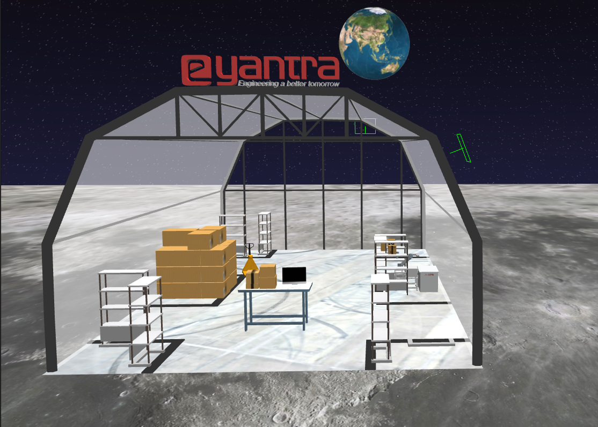
  </br>
  Figure 1: Arena in Gazebo Environment
</p>


2.1: Model Description
----------------------

-   **eBot:** 
    > A 4-wheeled robot capable of navigating an arena mapped
    > before, docking with the racks using electromagnet and bringing it
    > in-front of the robotic arm. The bot must manoeuvre itself
    > autonomously within the arena with the help of sensors available
    > on-board.

-   **UR5 arm:** 
    > A highly flexible robotic arm that enables safe
    > automation of repetitive, risky tasks. With a carrying capacity of
    > 5 KG and a radius of 850 mm, it is the perfect cobot for
    > performing light tasks such as packing, assembly or testing. The
    > arm should pick the boxes with the help of electromagnet and place
    > it on the drop location without any collisions.

-   **Arena**: 
    > The warehouse environment in which the boxes need to be
    > segregated (perspective view as shown in Figure 1 above).

2.2: Terms and Definitions
--------------------------

> Figure 2 and Table 1 describe the objects in the arena.

<p align="center">
  </br>
  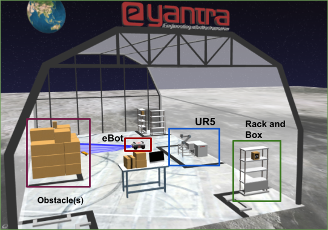
  </br>
  Figure 2: Different objects in the arena
</p>


<table>
    <thead align="center">
        <tr>
        <th>Objects</th>
        <th>Image</th>
        <th>Description</th>
        </tr>
    </thead>
    <tbody align="center">
        <tr>
            <td>Rack</td>
            <td>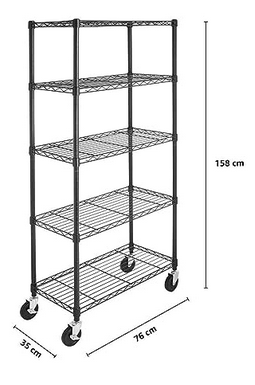</td>
            <td>Team has to attach the specified rack to the eBot and bring it in front of the arm to continue with segregation of packages. During the traversal of eBot with rack, the team has to avoid collision with any other object in the arena.</td>
        </tr>
        <tr>
            <td>eBot</td>
            <td></td>
            <td>eBot is the mobile robot used in the theme. It has a payload capacity of 100 Kg.</td>
        </tr>
        <tr>
            <td>UR5</td>
            <td>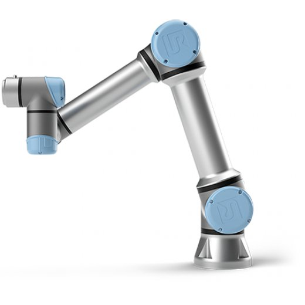</td>
            <td>The Universal Robot UR5 is a highly flexible robotic arm used in the theme that enables the safe automation of repetitive and risky tasks. It has a carrying capacity of 5 Kg.</td>
        </tr>
        <tr>
            <td>Package Box</td>
            <td>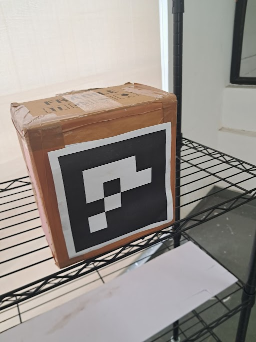</td>
            <td>These boxes are attached with Aruco markers on the front side. These Aruco markers have the number embedded into it which can be decoded using image processing.</td>
        </tr>
            <td colspan="3"><b><i>Table 1: Objects along with their description in the arena</i></b></td>
        </tr>
    </tbody>
</table>


2.3. Theme Flow Description
---------------------------

-   The task is to collect all the specified package boxes based on the
    configuration given by using eBot and UR5 robotic arm in the
    warehouse. The eBot brings the rack(s) containing boxes in front
    of the stationary robotic arm and thereafter the arm picks the box
    from the rack and places it on the table (or drop location).
-   The configuration file will be given before the run; a YAML file
    consisting of rack position (x, y, angle with respect to the
    eBot's initial position) and the package(s) to be picked with
    their ID number as the Aruco ID on the box. Each rack will have
    the same name as the Aruco ID associated with the box it has.
    Since there is only one box per rack which can be picked up,
    therefore the rack name and the box name remain the same for each.
    For example if a rack has a box with Aruco ID as 02, then the rack
    would be named as `rack2`. The YAML file looks like:
        
    ```
    position:
       rack1: [1, 2, 1.57]
       rack2: [2, 3, 5.21]
    package_id: [2, 3, 5]
    ```

-   eBot begins its execution from the start position as shown in Figure
    4 of the simulation/real-world environment. Home position of the
    bot is the spawn location itself.
-   eBot has to then navigate within the warehouse without any collision
    to make sure that the specified boxes in the configuration are
    placed correctly by docking underneath the rack, turning on the
    electromagnet to attach the eBot to the rack and bringing it in
    front of the robotic arm.
-   The robotic arm has to pick the package box which is on the rack
    using Moveit servo or by using in-built algorithms of the moveit
    package.
-   It has to finally drop those boxes into the drop location which is
    behind the arm (for drop position check figure 3 given below where
    the box is placed on the table behind the arm).

    <p align="center">
    </br>
    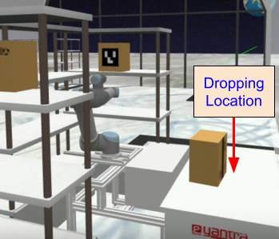
    </br>
    Figure 3: Drop location of the boxes is behind the arm.
    </p>

    

2.4: Arena Description
----------------------

> Figure 4 shows the sample camera view of the arena in IITB Warehouse.

-   Size of the room is approximately 12m x 20m

-   Views from 5 CCTV cameras and 1 realsense camera will be provided during the remote session.
    <p align="center">
    </br>
    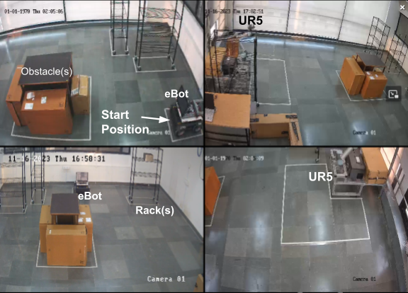
    </br>
    Figure 4: Remote Hardware Arena
    </p>


Details of the arena are as follows:

-   One rack will always be kept on the right side of UR5 to start with the run. This is shown in the top right image of Figure 4.

-   Team can start manipulation and navigation in parallel to save time.

-   Position of racks in the arena are fixed and will not change.

-   Total number of racks in the arena is 3 and each rack will contain only 1 box that can be picked.

-   Obstacle location will be random.

-   More about dimension and details about components can be found in Section 3.

**NOTE:** This is just a sample representation of the arena to get an
idea of the same. The dimension and position of the drawings of objects
are not in scale and according to the hardware arena.


[3: Robot Description](https://www.cse.iitb.ac.in/~saail/rulebook/AB-robot_description.html#3-robot-description)
================================================================================================================

3.1: eBot
---------

It is a four-wheeled robot that works on a skid steer drive control
mechanism. eBot consists of various sensors such as encoders, 2D LIDAR
and an Inertial Measurement Unit (IMU). Electromagnet (not shown in
Figure 5) is mounted on top of the robot.

<p align="center">
</br>
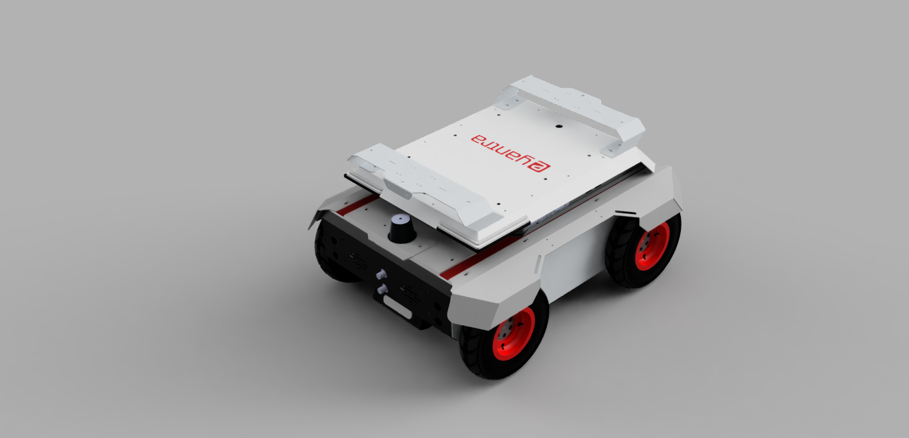
</br>
Figure 5: eBot
</p>


<table>
    <thead align="center">
        <tr>
        <th>Specification</th>
        <th>Measurement</th>
        </tr>
    </thead>
    <tbody align="center">
        <tr>
            <td>Dimension, Length</td>
            <td>650 mm (+/- 10 mm)</td>
        </tr>
        <tr>
            <td>Dimension, Width</td>
            <td>500 mm (+/- 10 mm)</td>
        </tr>
        <tr>
            <td>Dimension, Height</td>
            <td>310 mm (+/- 10 mm)</td>
        </tr>
        <tr>
            <td>Track Width</td>
            <td>440 mm (+/- 10 mm)</td>
        </tr>
        <tr>
            <td>Wheelbase Length</td>
            <td>420 mm (+/- 10 mm)</td>
        </tr>
        <tr>
            <td>Diameter of wheel</td>
            <td>210 mm (+/- 10 mm)</td>
        </tr>
        <tr>
            <td>Ground Clearance</td>
            <td>60 mm (+/- 10 mm)</td>
        </tr>
        <tr>
            <td>Mass</td>
            <td>32 kg</td>
        </tr>
        <tr>
            <td>Speed, Maximum</td>
            <td>1 m/s (Calculated)</td>
        </tr>
        <tr>
            <td>Climb Angle, Maximum</td>
            <td>~10° (Tested)</td>
        </tr>
    </tbody>
</table>
  
<p align="center">
</br>

</br>
Figure 6: Back view of eBot
</p>

<table>
    <thead align="center">
        <tr>
        <th>Component</th>
        <th>Description</th>
        </tr>
    </thead>
    <tbody align="center">
        <tr>
            <td>1</td>
            <td>LED Indicator</td>
        </tr>
        <tr>
            <td>2</td>
            <td>On/Off Switch</td>
        </tr>
        <tr>
            <td>3</td>
            <td>Reset Switch</td>
        </tr>
        <tr>
            <td>4</td>
            <td>5V (Top) and 12V (Bottom) Voltage Source</td>
        </tr>
        <tr>
            <td>5</td>
            <td>Emergency Switch</td>
        </tr>
        <tr>
            <td>6</td>
            <td>LCD Screen</td>
        </tr>
        <tr>
            <td>7</td>
            <td>Battery Connector</td>
        </tr>
        <tr>
            <td>8</td>
            <td>Ultrasonic sensors</td>
        </tr>
        <tr>
            <td>9</td>
            <td>Back wheels</td>
        </tr>
    </tbody>
</table>

<p align="center">
</br>
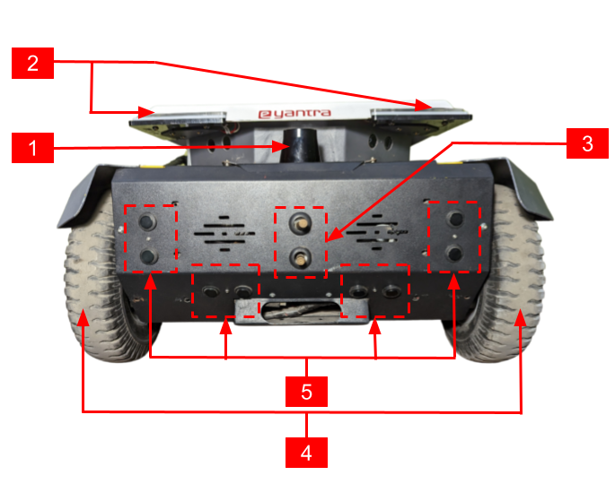
</br>
Figure 7: Front view of eBot
</p>

<table>
    <thead align="center">
        <tr>
        <th>Component</th>
        <th>Description</th>
        </tr>
    </thead>
    <tbody align="center">
        <tr>
            <td>1</td>
            <td>LIDAR</td>
        </tr>
        <tr>
            <td>2</td>
            <td>Eye LEDs</td>
        </tr>
        <tr>
            <td>3</td>
            <td>External connection for Docking</td>
        </tr>
        <tr>
            <td>4</td>
            <td>Front wheels</td>
        </tr>
        <tr>
            <td>5</td>
            <td>Ultrasonic sensors</td>
        </tr>
    </tbody>
</table>
 

3.2: 2D LiDAR
-------------

The following are the features of the 2D LiDAR sensor used in an eBot:

1.  Working range of 0.5m to 20m.

2.  Scanning angle of 270 degrees.

<p align="center">
</br>
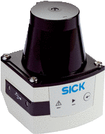
</br>
Figure 8: 2D LiDAR
</p>


3.3: UR5 robotic arm
--------------------

The Universal Robot UR5 is a highly flexible robotic arm that enables
the safe automation of repetitive and risky tasks. With a carrying
capacity of 5 KG and a radius of 850 mm, it is the perfect cobot for
performing light tasks such as packing, assembly, or testing.


<p align="center">
</br>

</br>
Figure 9: UR5 Robotic Arm
</p>

<table>
    <thead align="center">
        <tr>
        <th>System Parameter</th>
        <th>UR5</th>
        </tr>
    </thead>
    <tbody align="center">
        <tr>
            <td>Degrees of Freedom</td>
            <td>6 rotating joints</td>
        </tr>
        <tr>
            <td>Payload</td>
            <td>5 kg / 11 lbs</td>
        </tr>
        <tr>
            <td>Repeatability</td>
            <td>±0.1 mm / ±0.0039 in (4 mils)</td>
        </tr>
        <tr>
            <td>Weight with cable</td>
            <td>18.4 kg / 40.6 lbs</td>
        </tr>
        <tr>
            <td>Reach</td>
            <td>850 mm / 33.5 in</td>
        </tr>
        <tr>
            <td>Motion Range</td>
            <td>Base: ± 360°</br>
                Shoulder: ± 360°</br>               
                Elbow: ± 360°</br>             
                Wrist 1: ± 360°</br>           
                Wrist 2: ± 360°</br>                            
                Wrist 3: ± 360°
            </td>
        </tr>
        <tr>
            <td>Maximum Speed</td>
            <td>Base: ± 180°/Sec.</br>
                Shoulder: ± 180°/Sec.</br>
                Elbow: ± 180°/Sec.</br>
                Wrist 1: ± 180°/Sec.</br>
                Wrist 2: ± 180°/Sec.</br>
                Wrist 3: ± 180°/Sec.
            </td>
        </tr>
        <tr>
            <td>Power Consumption</td>
            <td>Min 90W, Typical 150W, Max 325W</td>
        </tr>
        <tr>
            <td>Robot Mounting</td>
            <td>Any</td>
        </tr>
        <tr>
            <td>Ambient Temperature Range</td>
            <td>0-50°</td>
        </tr>
    </tbody>
</table>
 

3.4: Depth Camera
-----------------

The depth camera used is of stereo depth type and has a range of 0.105m
to 10m. It also has an inbuilt IMU sensor.

<p align="center">
</br>
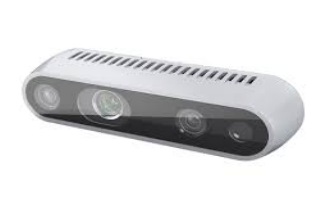
</br>
Figure 10: Depth Camera used in the Cosmo Logistic
</p>


**NOTE:** **There might be slight differences between the simulator and
real hardware**.

3.5: Magnet/Gripper
-------------------

This is a custom made magnet case for picking up objects using magnetic
force. The boxes have a metal plate embedded inside them (behind the
Aruco marker), which will help the arm to pick the box using its magnet.
The gripper consists of two electromagnets attached in parallel to 24V
DC supply with each consuming 0.25A. The user needs to make sure that
the plane of magnet and box surface are parallel while trying to pick
the box.

<p align="center">
</br>
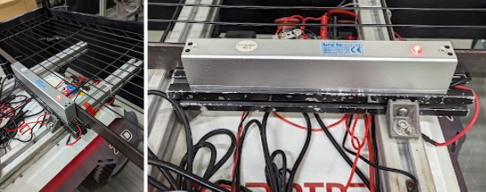
</br>
Figure 11: Electromagnet on eBot used for attaching rack
</p>

<p align="center">
</br>
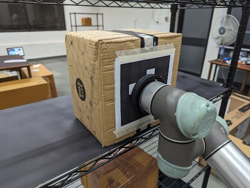
</br>
Figure 12: Electromagnet on UR5 used for attaching box
</p>


4: Judging and Scoring Formula
==============================

The team's total score is calculated using the following formula

> **Total_marks** = (900-T) \* 0.4 + ACI \* 10 + ACP \* 50 + ACD \* 50 + ECN \* 50 + ECP \* 20 + ECD \* 50 - P \* 25 + B \* 300

The abbreviation details are as follows:

> **T: Total time** taken for the run. If it is found to be greater
> than 900 seconds or no valid run, then the marks for the time will
> be made zero.
>
> **Valid Run:** A run is considered valid if the team is able to
> place at least one box on the drop table.
>
> **ACI: Arm Correct Identification**, parameter is increased when the
> TF is correctly published pointing to the Aruco marker's centre
> position. The maximum value of this parameter is 3.
>
> **ACP: Arm Correct Position**, parameter increases when the package
> is picked up using the magnetic gripper on the arm. The maximum
> value of this parameter is 3.
>
> **ACD: Arm Correct Drop**, parameter increases when the package is
> dropped on the table kept behind the arm. The maximum value of
> this parameter is 3.
>
> **ECN: eBot Correct Navigation**, parameter increases when the eBot
> is within the desired perimeter of the rack. Repeated attempts to
> enter into the area of the same rack will not yield to any
> additional marks. The maximum value of this parameter is 2.
>
> **ECP: eBot Correct Pick**, parameter increases when the eBot has
> correctly docked and attached the rack with the eBot using magnet.
> The maximum value of this parameter is 2.
>
> **ECD: eBot Correct Drop**, parameter increases when the eBot has
> correctly dropped the rack in front of the arm. The maximum value
> of this parameter is 2.
>
> **P: Penalty**, parameter increases for any point given in the theme
> rules penalty section.
>
> **B: Bonus**, is a binary parameter. It will be considered as one,
> if the team completes the given task of placing specified boxes on
> the drop table without any penalty.

**Note:** Detection and recognition of package boxes other than the
specified ones will yield no marks.

**5: Theme Rules**
==================

*Read all instructions carefully to maximise your score.*

5.1 Execution Prerequisites
---------------------------

-   The timer will start when the eBot starts to move for the first time.

-   The maximum time to complete the task is 900 seconds (15 minutes).

-   A run will be considered **valid** only when-

    -   The team has correctly identified and correctly Pick-&-Place at least one package box in the drop location.

-   Once the robot starts, manual teleop operations are NOT allowed. If made, that intervention is treated as cheating, and the run will not be considered for evaluation.

-   Time will be considered maximum if the Valid Run criterion is not achieved.

5.2 Navigation
--------------

-   The eBot should start navigating the arena from the Home position or Start zone (i.e., the spawn position itself).

-   Teams are allowed to make eBot follow any order/pattern of navigating the entire arena.

-   The eBot should be within the desired perimeter of the rack i.e. 1m x 1m area around the rack to consider a valid ECN.

-   eBot should drop the rack within the specified boundary as shown in figure 3 from the UR5 base for a valid ECD drop.

5.3 Perception
--------------

-   Teams are awarded points for every correctly identified (ACI) Aruco marker box. To get ACI, teams must display the transform, i.e., 'tf' of the desired object with its identity inside the RViz.

-   Teams should also broadcast 'tf' continuously for each package box with respect to `base_link`. For other frames of reference (like the camera), the team should rename the frame accordingly.

-   The name of the TF should be `obj_<aruco_id>`. Repeated publishing of TF will not yield any additional marks.

5.4 Arm Manipulation
--------------------

-   Adhere to the instructions given in the scoring formula section related to ACI, ACP and ACD.

-   Make sure that any action taken by the arm should not lead into collision with the rack, table, base or itself. In case of the same, it will lead to a penalty.

-   After picking the package box a related information can be printed in the terminal, for example, `<object_name>_Picked`.

-   The dropping of the box should not lead to falling off the same box or the other box on the dropping location. If found, the ACD parameter value will not be increased. Related information can be printed in the terminal, for example `<object_name>_Dropped`.

5.5 Penalty
-----------

Penalty will be considered if:

-   The arm collides/damages any of the rack, table, UR5 base or itself.

-   The eBot collides with walls, obstacles on the arena or the base of UR5.

-   After correctly picking the rack and eBot is considered as one body, therefore any collision to the rack during its transit is considered as collision with eBot.

5.6 Bonus
---------

-   A bonus will be given for all the specified boxes are identified, picked, and deposited from the rack on the table (drop position) kept behind the arm, without any collision.

5.7 Rerun and Restart
---------------------

-   Team will get in total 2 runs, if a team opts for re-run it should be made known to the developers before a valid run is completed.

-   If the team completes a valid run, they will not be able to opt for a re-run.

-   The eBot will be stopped manually if it is seen to be damaging/colliding any objects on the arena.

-   The eBot if found in a non-recoverable position or in a collision position, the control will be taken away from the team and it will be brought back to a safe distance away from the collided position. After that the eBot's control will be given back to the team for further movement. During this process the team is not allowed to change the code, or make any input to the team's computer.

-   If the arm results in a protective stop (i.e. if arm enters into self protection sequence while manipulation) the arm will be brought back to a normal state (i.e. default start state) by the developers. During the process the team is not allowed to give any input to the computer.

5.8 End of the Run
------------------

-   End of the run will be considered whenever the team completes the whole task by placing all the specified boxes as per the configuration on the drop table using eBot and arm.

-   Or, whenever the team requests for the end of the run by conveying the same to the theme developers during the run.


6: Disclaimer
=======================

In case of any disputes/discrepancies, the e-Yantra decision is final
and binding. e-Yantra reserves the right to change any or all of the
above rules as we deem fit. Any changes to the rules will be highlighted
on the website and notified to the participating teams.

7: Additional Resources
=======================

-   [[https://www.intelrealsense.com/beginners-guide-to-depth/]{.underline}](https://www.intelrealsense.com/beginners-guide-to-depth/)

-   [[https://www.intelrealsense.com/depth-camera-d435i/]{.underline}](https://www.intelrealsense.com/depth-camera-d435i/)

-   [[https://www.sick.com/in/en/detection-and-ranging-solutions/2d-lidar-sensors/lms1xx/c/g91901]{.underline}](https://www.sick.com/in/en/detection-and-ranging-solutions/2d-lidar-sensors/lms1xx/c/g91901)

-   [[https://www.universal-robots.com/products/ur5-robot/]{.underline}](https://www.universal-robots.com/products/ur5-robot/)

-   [[https://clearpathrobotics.com/blog/2020/07/clearpath-robots-get-new-gazebo-simulation-environments/]{.underline}](https://clearpathrobotics.com/blog/2020/07/clearpath-robots-get-new-gazebo-simulation-environments/)