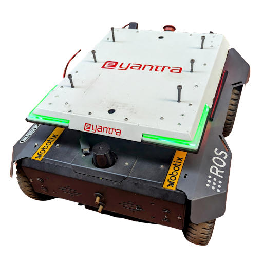

<!-- 

 -->

<!--  -->

    <h1>Cosmo Logistic</h1>

---

 

## Theme Introduction

The “Cosmo Logistic” theme of eYRC 2023-24 is set in a warehouse used for inter-planet logistics from a space station. A robotic arm and mobile robot collaborate to sort and prepare packages to be transported to different planets. In this theme, teams will develop an algorithm for sorting packages autonomously with the help of a robotic arm and mobile robot shown in the figure. Teams will learn to navigate this mobile robot with the help of SLAM (simultaneous localization and mapping) method in a warehouse, detect and localise the packages placed on racks, and manipulate the robotic arm to pick them. In stage 1 of the competition, teams will complete this theme in a simulator (Gazebo) and in stage 2, they will get remote access to “Real” hardware present in a “Real” warehouse at IIT Bombay.

**Learnings:** Robot Operating System 2 (ROS 2), Gazebo, MoveIt 2, Computer Vision, Git, RViz 2, Nav 2

**Implementation:** Simulator + Real Industrial Robot (Remote Access)

## System Requirements:

- **Operating System:** Ubuntu 22.04 LTS

- **Processor:** eight cores, x86_64 (64-bit x86 Instruction Set)

- **HDD or SSD Storage space:** 50GB or more

- **RAM:** 8GB or more

- **Dedicated graphics card:** preferable

- **Internet:** Minimum speed of 5 Mbps & latency <= 50ms

---